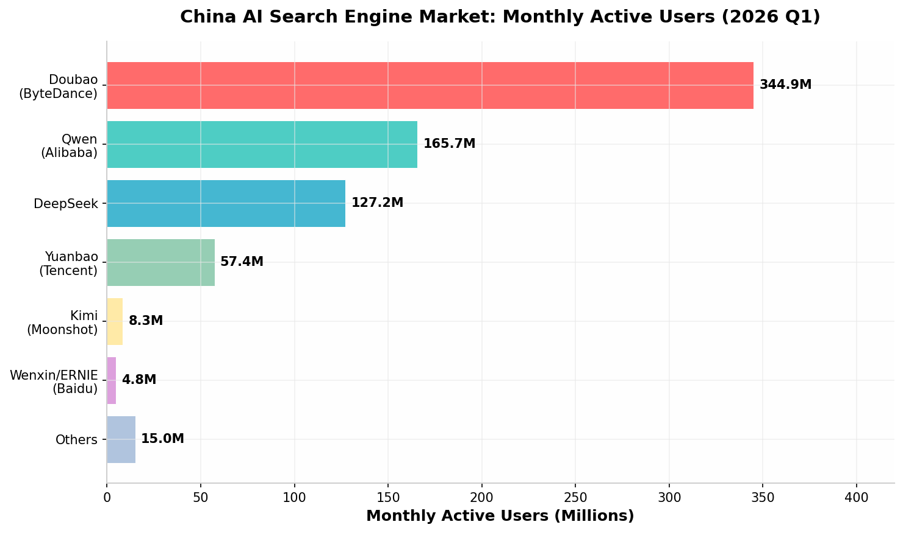

To build a high-performing 100+ page GEO website serving both global and Chinese AI search ecosystems, the core strategy is a **Dual-Track GEO Architecture**: (1) **World-to-China** — adapt global GEO best practices (direct-answer formatting, structured data, entity authority) to China's "Big Six" AI platforms (Doubao, DeepSeek, Qwen, Kimi, Yuanbao, Baidu AI) with Simplified Chinese content, mainland hosting/ICP licensing, and authority signals on Zhihu, Baidu Baike, and WeChat; and (2) **China-to-World** — help Chinese brands achieve global AI visibility through English-language thought leadership, international press coverage, and optimization for ChatGPT, Perplexity, and Gemini. The website should use a **topic cluster architecture** with 4 pillar pages, 24 spoke pages, and 72+ detailed pages, implementing bilingual subdirectories (`/en/`, `/zh/`), comprehensive schema markup (Article, FAQ, HowTo, Organization), `llms.txt` for AI crawlers, and a 3-tier KPI framework (Citation Rate, Share of Model, Sentiment Score) for measurement.

---

# GEO Two-Way Research: World to China & China to the World — A Strategic Blueprint for 100+ Page Website Production

## 1. Executive Summary: The Dual-Track GEO Imperative

### 1.1 Defining the Two-Way Research Scope

The digital discovery landscape has undergone a paradigm shift of historic proportions. Where traditional search engine optimization (SEO) once focused on securing prominent rankings in pages of blue links, the emergence of generative artificial intelligence has birthed an entirely new discipline: **Generative Engine Optimization (GEO)**. This research report addresses a critical and complex challenge that no existing playbook fully resolves — how to architect and optimize a large-scale website (encompassing 100+ pages) that effectively serves two diametrically opposed yet deeply interconnected directions: **World to China** and **China to World**. The former direction involves adapting global GEO best practices to the unique, fragmented, and heavily regulated Chinese AI search ecosystem, dominated by platforms such as Baidu's Ernie Bot, DeepSeek, ByteDance's Doubao, and Alibaba's Qwen. The latter direction addresses how Chinese brands can leverage GEO to build visibility and authority on global AI platforms like ChatGPT, Perplexity, and Google's Gemini. This two-way research is not merely an academic exercise; it is a strategic imperative for any organization seeking to navigate the new reality where AI mediates the vast majority of information discovery, recommendation, and purchase decisions.

The scope of this research is deliberately comprehensive, spanning the theoretical foundations of GEO, the distinct technical and content requirements of Chinese versus Western AI ecosystems, and the practical execution of a large-scale content production pipeline. It investigates how content must be structured, authored, and technically marked up to be "extractable" and "citable" by large language models (LLMs). It delves into the specific platform nuances of China's **"Big Six" AI search engines**, examining their differing content preferences, authority signals, and user bases. Furthermore, it outlines a scalable, data-driven methodology for producing over 100 pages of GEO-optimized content, detailing the topic cluster architecture, content workflows, and measurement frameworks necessary to manage such an ambitious project. The report culminates in an actionable blueprint that unifies these elements into a cohesive strategy, enabling a single website to serve as a powerful, bidirectional conduit for information and brand authority across the world's most significant — and most divergent — digital markets.

### 1.2 Why a Unified Strategy Matters for Global and Chinese Markets

Treating global GEO and China GEO as separate, siloed initiatives is a strategic error with significant opportunity costs. While the underlying principles of GEO — clarity, authority, structure, and extractability — are universal, their application is highly contextual. A unified strategy is essential because the two directions are not independent; they influence and inform each other in profound ways. For a multinational corporation entering China, its global reputation and English-language content on international platforms create foundational "entity signals" that Chinese AI models may reference, even if subconsciously. Conversely, for a Chinese brand going global, its domestic presence and authority on platforms like Zhihu and Baidu Baike contribute to its overall entity richness, which can be leveraged in global markets. A unified strategy ensures that content production is efficient, with core "answer nuggets" and data points being adapted and localized rather than created from scratch for each market. This approach maximizes the return on content investment and ensures brand consistency across all AI-mediated touchpoints.

The importance of a unified strategy is magnified by the behavior of the AI systems themselves. Modern LLMs are trained on vast, multilingual datasets. A brand that demonstrates topical authority and trustworthiness in both English and Chinese is more likely to be perceived as a global leader by AI models, regardless of the user's language or location. A unified approach to technical infrastructure, such as implementing a single, well-structured `llms.txt` file and consistent schema markup, provides clear signals to all AI crawlers, both domestic and international. Furthermore, a unified measurement framework allows for holistic performance tracking, revealing how investments in one market (e.g., publishing a whitepaper on DeepSeek) might positively impact visibility in another (e.g., being cited in ChatGPT for a related query). In an era where AI is collapsing geographical and linguistic barriers in information synthesis, a fragmented strategy is not just inefficient — it is invisible.

### 1.3 Key Findings and Strategic Recommendations

This research has yielded several critical findings that form the bedrock of the strategic recommendations presented in this report. First, **GEO is not an evolution of SEO but a distinct discipline** with its own set of KPIs, such as **Citation Rate** and **Share of Model (SoM)**, which measure visibility within AI-generated answers rather than rankings on a search results page [^77^][^91^]. Second, **the Chinese AI ecosystem is not a monolith**. It is a fiercely competitive landscape comprising at least six major platforms, each with unique characteristics. As of early 2026, **Doubao leads with approximately 345 million monthly active users (MAU)**, followed by **Qwen (166M)**, **DeepSeek (127M)**, and **Yuanbao (57M)**, with Baidu's Wenxin trailing significantly at under 5M MAU [^48^][^46^]. This necessitates a multi-platform optimization strategy within China itself. Third, **technical implementation is a non-negotiable prerequisite**. Fundamental elements like ** mainland China hosting, an ICP license, bilingual `llms.txt` and `robots.txt` files, and comprehensive JSON-LD schema markup** are the table stakes for being discovered and trusted by both Chinese and global AI crawlers [^11^][^36^].

The strategic recommendations are organized around a **Dual-Track Architecture**.

*   **For the World-to-China Track:** The primary recommendation is to build authority on **Chinese-native platforms**. This means establishing a verified, active presence on **Baidu Baike (the equivalent of Wikipedia), Zhihu (for expert citations), and WeChat Public Accounts (for long-form, indexed content)** [^24^]. Content must be created natively in Simplified Chinese, focusing on conversational, intent-rich queries rather than direct translations of English keywords. Technical compliance, including ICP licensing and hosting within mainland China, is paramount for visibility on Baidu's ecosystem [^10^].

*   **For the China-to-World Track:** The core strategy is to develop **high-quality, original English-language thought leadership** that targets global AI platforms. This involves publishing original research, data-driven reports, and expert commentary on international media and industry forums. Building authority signals on Western platforms like LinkedIn, Reddit, and in the trade press is crucial, as domestic Chinese authority does not automatically transfer to global AI systems [^11^]. The website must be hosted on internationally accessible infrastructure with fast load times and mobile optimization.

*   **For the 100+ Page Website Production:** The recommended architecture is a **Topic Cluster Model**, built around **four central pillar pages**: "GEO Fundamentals," "China AI Ecosystem," "World-to-China Strategy," and "China-to-World Strategy." Each pillar branches into six spoke pages, which in turn lead to detailed sub-pages, creating a semantic web of interconnected content that signals deep topical authority to AI models [^30^][^35^]. The URL structure should use **bilingual subdirectories (e.g., `/en/` and `/zh/`)** with proper `hreflang` tags to signal language and regional targeting clearly [^56^][^61^].

*   **For Measurement:** Success must be tracked using a **Three-Tier KPI Framework**. **Tier 1 (Leading Indicators)** tracks **Mention Rate** and **Citation Rate** weekly. **Tier 2 (Strategic Context)** monitors **Sentiment Score** and **Share of Voice** monthly. **Tier 3 (Business Impact)** connects GEO efforts to revenue by measuring **AI-Referred Traffic** and **AI-Attributed Conversions** [^77^][^83^].

## 2. The Global GEO Landscape: Foundational Principles

The emergence of Generative Engine Optimization (GEO) represents a fundamental paradigm shift in digital marketing, moving beyond the keyword-centric and backlink-focused world of traditional Search Engine Optimization (SEO). GEO is the strategic practice of structuring a brand's digital presence — its content, authority signals, and technical infrastructure — to be discovered, trusted, and cited by generative AI engines. These engines, which include platforms like ChatGPT, Perplexity, Google's AI Overviews, and a rapidly growing ecosystem of specialized models, do not merely rank web pages. Instead, they synthesize information from multiple sources to generate direct, conversational answers to user queries. This shift from a "list of links" to a "single answer" model has profound implications for how brands achieve visibility. In the GEO era, success is not defined by a #1 ranking on a Search Engine Results Page (SERP), but by being the authoritative source that an AI model chooses to reference, quote, or recommend within its generated response. This new landscape prioritizes content that is clear, factual, well-structured, and highly "extractable" by machine intelligence.

### 2.1 Defining Generative Engine Optimization (GEO)

Generative Engine Optimization (GEO) is the discipline of optimizing digital content to increase a brand's visibility, credibility, and frequency of citation within AI-generated responses. Unlike traditional SEO, which focuses on improving a website's ranking in search engine results pages (SERPs) through keywords, backlinks, and technical signals, GEO targets the training data, retrieval systems, and credibility algorithms that power AI search engines [^38^]. The core objective of GEO is to position a brand's content as a preferred source of truth that AI models like ChatGPT, Claude, and Google's Gemini will reference when synthesizing answers to user queries. This involves creating content that is not only valuable to human readers but also structured in a way that is easily parsable, quotable, and verifiable by machine intelligence. The ultimate goal is to secure a share of the AI-generated answer, often referred to as **"Share of Model" (SoM)**, transforming the brand from a simple search result into an integral part of the AI's knowledge fabric [^41^].

The fundamental shift from SEO to GEO can be understood as a change in the target audience and the medium of discovery. In SEO, the competition is for the user's click on a search results page. In GEO, the competition is for the AI's "trust" and "selection" during the answer generation process. This means that even if a user never clicks through to the brand's website, the brand can achieve significant value simply by being mentioned or cited in the AI's response. This "zero-click" visibility builds brand awareness, establishes authority, and pre-qualifies prospects who may later search for the brand directly. GEO, therefore, requires a new set of strategies and metrics focused on entity recognition, factual accuracy, semantic relevance, and the ability to provide direct, concise answers to complex questions. It is a holistic approach that combines content marketing, technical SEO, public relations, and data science to build an AI-friendly digital ecosystem.

#### 2.1.1 GEO vs. SEO: Core Differences

The divergence between Generative Engine Optimization (GEO) and traditional Search Engine Optimization (SEO) is rooted in their fundamental goals, target platforms, and success metrics. While SEO is primarily concerned with ranking web pages in the organic search results of engines like Google and Bing, GEO focuses on influencing the answers generated by AI platforms such as ChatGPT, Perplexity, and Google AI Overviews [^36^]. This distinction creates a ripple effect across all aspects of digital strategy, from content creation to performance measurement. The following table provides a detailed comparison of the core differences between these two critical disciplines.

| Feature | Traditional SEO | GEO (Generative Engine Optimization) |
| :--- | :--- | :--- |
| **Primary Goal** | Rank pages in search results to earn clicks. | Be cited and recommended as a source in AI-generated answers. |
| **Target Platforms** | Google, Bing, Baidu, Yahoo | ChatGPT, Perplexity, Gemini, DeepSeek, Doubao, Kimi [^6^] |
| **Core Focus** | Keywords, backlinks, on-page technical signals. | Authority, quotability, factual accuracy, semantic relevance. |
| **Key Metrics** | Rankings, organic traffic, Click-Through Rate (CTR). | **Citation Rate**, **Share of Model (SoM)**, brand mention sentiment. |
| **Content Strategy** | Web pages, blogs optimized for keywords and user intent. | In-depth, data-backed, structured content with direct answers. |
| **Optimization Object** | Web pages and their elements (titles, meta descriptions). | The brand as an "entity" and the information it provides. |
| **Success Model** | High traffic volume from top rankings. | High-quality, AI-referred traffic and brand recall from citations. |
| **User Interaction** | User clicks a link to visit the website. | User gets information directly from the AI (zero-click result). |

*Table 1: A comparative analysis of the core differences between traditional SEO and the emerging discipline of GEO.*

The table above highlights the strategic pivot required when moving from an SEO-centric to a GEO-centric approach. **SEO is about being found; GEO is about being known and trusted by AI.** The metrics of success are entirely different. Where an SEO manager celebrates a #1 ranking for a high-volume keyword, a GEO strategist celebrates a brand being consistently cited by ChatGPT or Perplexity as a top solution in its category. This shift necessitates a change in content philosophy. SEO content often aims to draw the user into a narrative to encourage a click and a conversion. GEO content, on the other hand, must be designed for "extractability" — providing clear, self-contained "answer nuggets" that an AI can lift and use directly in its response [^1^]. The ultimate aim of GEO is to build such a strong foundation of authority and trust that AI engines not only find your content but prefer it as a source, integrating your brand into the very fabric of AI-generated knowledge.

#### 2.1.2 The Shift from Keywords to Entities and Answers

The most profound conceptual shift from SEO to GEO is the move from a keyword-centric model to an **entity- and answer-centric model**. Traditional SEO operates largely on keyword density and matching user search queries to keywords present on a web page. While modern SEO has evolved to consider search intent and topics, its foundational mechanics are still tied to words and phrases. Generative Engine Optimization, however, operates on a completely different level. AI engines like ChatGPT and DeepSeek do not think in keywords; they understand the world through **entities** (people, places, concepts, brands) and the **relationships** between them. When a user asks, "What is the best CRM for a small business?", the AI doesn't search for the keyword "best CRM." It queries its knowledge graph for the entity "CRM software," understands its relationship to the entity "small business," and then synthesizes an answer based on its understanding of which brands (entities) are most relevant, authoritative, and highly regarded within that specific context [^4^].

This shift fundamentally changes the optimization task. Instead of stuffing a page with keywords, GEO strategists must focus on **building "entity authority."** This involves ensuring that the brand is clearly defined as a distinct entity across the web, with consistent information on its own website (via schema markup), on social media profiles, in industry directories, and in third-party publications. The goal is to make the brand "entity-salient" — meaning the AI recognizes it as a valid and important player in its specific domain [^4^]. Furthermore, the focus shifts from ranking for a keyword to **owning the answer to a question**. Content must be structured to provide direct, factual, and comprehensive answers to the conversational questions users are increasingly asking AI. This means formatting content with clear headings that mirror user questions, providing concise definitional paragraphs, and using structured formats like FAQs, tables, and how-to guides that are easy for an AI to parse and extract. In the GEO paradigm, the brand that provides the clearest, most authoritative, and most easily extractable answer to a user's question is the one that wins the citation.

### 2.2 Universal GEO Best Practices

While the AI landscape is diverse, a set of universal best practices has emerged that forms the foundation of any effective GEO strategy. These practices are designed to make content more discoverable, trustworthy, and extractable by a wide range of AI engines. They combine principles of clear writing, structured data, technical optimization, and authority building. The core idea is to create a digital presence that is not only user-friendly but also "machine-friendly," providing AI systems with clear signals about a brand's identity, expertise, and the value of its content. These foundational elements are applicable whether the target is a global platform like Perplexity or a domestic Chinese AI like Doubao, although their specific implementation may require localization.

#### 2.2.1 Content Structure: Direct-Answer Formatting

The single most important content strategy for GEO is to structure information for **direct-answer extraction**. AI engines prioritize content that can be easily parsed and synthesized into a coherent response. This means moving away from long, narrative paragraphs and adopting a format that resembles a well-organized knowledge base or a detailed FAQ. The goal is to create "answer nuggets" — short, self-contained passages of 2-4 sentences that directly answer a specific question [^2^]. A highly effective technique is to begin every major section with a definitional paragraph that follows a clear structure: "[Term] is [definition]. It works by [process]. It matters because [outcome]." This three-part structure has proven to be a reliable trigger for AI citation because it provides a complete, contextual answer in a single, extractable unit [^2^].

To maximize extractability, content should be formatted for machine parsing. This involves using a clear and logical hierarchy of headings (H2, H3) that are descriptive and often phrased as questions (e.g., "How does X work?"). Paragraphs should be kept concise, ideally under 120 words, and information should be broken down using bullet points, numbered lists, and comparison tables [^1^]. These structured elements are highly favored by AI because they present information in a clean, sequential, or comparative format that is easy to synthesize. For example, a comparison table of different software features can be directly lifted by an AI to answer a "compare X vs. Y" query. The key principle is to design each section of content to stand on its own, providing enough context to be understood without requiring the reader (or the AI) to parse the entire surrounding article.

#### 2.2.2 E-E-A-T Signals: Experience, Expertise, Authoritativeness, Trustworthiness

**E-E-A-T** (Experience, Expertise, Authoritativeness, and Trustworthiness) is a framework originally developed by Google to assess content quality, but it has become a cornerstone of GEO as well. AI engines are fundamentally designed to provide accurate and reliable information, and they are therefore programmed to prioritize sources that demonstrate strong E-E-A-T signals. **Experience** refers to the creator's first-hand knowledge of the topic. Content that includes original research, case studies, or personal anecdotes is highly valued. **Expertise** is demonstrated through the depth and accuracy of the content. This can be signaled by the author's credentials, the inclusion of technical details, and the comprehensiveness of the coverage. **Authoritativeness** is built through citations and recognition from other reputable sources. Being mentioned in industry publications, earning backlinks from high-authority domains, and having a strong presence on professional networks all contribute to authoritativeness. Finally, **Trustworthiness** is established through transparency, accuracy, and a secure website. This includes providing clear author bios, citing primary sources for all claims, keeping content up-to-date, and ensuring the site uses HTTPS [^2^][^5^].

To operationalize E-E-A-T for GEO, brands should focus on several key actions. First, ensure all content is authored by named individuals with verifiable expertise, and include detailed author bios that highlight their qualifications. Second, **cite all factual claims with links to high-authority, primary sources** such as government websites, academic institutions, and recognized industry reports, always including the publication year to signal recency [^1^]. Third, publish original data and research, such as industry benchmarks, surveys, or teardowns. This type of proprietary content is highly valuable to AI engines because it provides unique information that cannot be found elsewhere, making the brand a primary source [^8^]. Fourth, actively work to earn mentions and backlinks from credible third-party sites, as these act as votes of confidence that significantly influence how generative engines evaluate a source's credibility [^5^].

#### 2.2.3 Technical Foundations: Crawlability, Speed, and Mobile-First Design

Even the most well-structured and authoritative content will fail in GEO if the technical foundation of the website is flawed. Technical optimization ensures that AI crawlers can efficiently access, parse, and understand the content. The three pillars of technical GEO are crawlability, speed, and mobile-first design. **Crawlability** is the most fundamental requirement. It is crucial to ensure that a website's `robots.txt` file does not inadvertently block the user-agents of major AI crawlers. This includes Bingbot (which powers much of ChatGPT's search), `OAI-SearchBot` (OpenAI's search crawler), and `ChatGPT-User` (used for live lookups). Many sites block all bots except Googlebot, a practice that can render a site invisible to a significant portion of the AI search ecosystem [^1^]. A well-configured `robots.txt` should explicitly allow these critical crawlers.

**Page speed** is another critical technical factor. AI crawlers, like human users, prefer fast-loading websites. Slow load times can prevent crawlers from fully indexing a site's content, especially on large sites. Optimizing Core Web Vitals — including Largest Contentful Paint (LCP), First Input Delay (FID), and Cumulative Layout Shift (CLS) — is essential for providing a good user experience and ensuring efficient crawler access [^32^]. This includes techniques like image compression, minifying CSS and JavaScript, and leveraging browser caching. Finally, a **mobile-first design** is non-negotiable. With the majority of internet traffic, especially in markets like China, coming from mobile devices, AI engines prioritize mobile-friendly websites. This means ensuring a responsive design, fast mobile load times, and touch-friendly interfaces. Baidu, in particular, uses mobile-first indexing, making mobile optimization a critical prerequisite for visibility in its ecosystem [^11^][^32^].

#### 2.2.4 The Role of Structured Data and Schema Markup

Structured data, implemented through **Schema.org vocabulary and JSON-LD format**, is one of the most powerful technical tools for GEO. It provides a standardized, machine-readable way to explicitly tell AI engines what a page is about, who authored it, and what entities it contains. While humans can infer this information from the content, structured data removes all ambiguity for machines. This is particularly important for Retrieval-Augmented Generation (RAG) systems, which rely on understanding the context and relationships between content elements to generate accurate answers [^1^]. Implementing schema markup is like adding a layer of "AI-friendly" subtitles to a website's content, making it significantly easier for models to parse and trust.

For GEO purposes, several key schema types are essential. **Organization schema** should be used on the homepage to clearly define the brand entity, including its name, logo, description, and links to social profiles. **Person schema** should be used on author pages to establish the expertise and authority of content creators. **Article schema** should be applied to all blog posts and articles, marking up the headline, author, publication date, and main image. For content designed to answer specific questions, **FAQPage schema** and **HowTo schema** are highly effective, as they explicitly tag questions and their corresponding answers, making them prime candidates for extraction by AI [^5^][^8^]. Implementing this markup comprehensively across a website creates a rich knowledge graph that helps AI systems understand the site's content hierarchy and expertise areas, dramatically increasing the likelihood of being cited.

### 2.3 The Global AI Search Ecosystem: Key Players

The global AI search ecosystem in 2026 is a dynamic and competitive landscape, far beyond the domain of a single company. While Google's AI Overviews and OpenAI's ChatGPT are the most prominent names in the West, a diverse array of platforms has emerged, each with its own unique approach to AI-driven information retrieval. These platforms can be broadly categorized into two groups: the integrated AI assistants from major tech companies and the specialized "answer engines" that have built their entire model around generative search. Understanding the distinct characteristics, strengths, and content preferences of these key players is essential for crafting an effective global GEO strategy. Each platform uses different underlying models, training data, and retrieval mechanisms, meaning that a one-size-fits-all approach to GEO is destined to fail.

#### 2.3.1 Western Platforms: ChatGPT, Perplexity, Gemini, and AI Overviews

In the Western market, four platforms dominate the AI search landscape, each offering a unique user experience and leveraging different approaches to content discovery and citation. **ChatGPT**, powered by OpenAI's GPT models, is the most well-known conversational AI. Its search functionality, often integrated with Microsoft's Bing, provides synthesized answers with source links. For GEO, ChatGPT values content that is well-structured, authoritative, and appears on sites with strong domain authority. It is particularly adept at extracting information from FAQs, how-to guides, and comparison articles. **Perplexity AI** positions itself as a pure "answer engine." Its primary differentiator is its heavy reliance on and clear display of source citations. For Perplexity, being cited is the entire point, making it a critical platform for GEO. It favors content from academic sources, reputable news outlets, and well-established industry blogs. **Google's Gemini** and **AI Overviews** (formerly SGE) represent the search giant's integration of generative AI directly into its search results. AI Overviews appear at the top of the SERP for many queries, synthesizing an answer from multiple sources. Optimizing for AI Overviews requires a strong traditional SEO foundation combined with GEO best practices, such as clear, direct answers and structured data. Gemini, as a standalone assistant, competes directly with ChatGPT and values similar signals of authority and comprehensiveness.

#### 2.3.2 The Rise of Specialized and Vertical AI Search Tools

Beyond the general-purpose giants, a new wave of specialized and vertical AI search tools is emerging. These platforms focus on specific domains or use cases, offering a more tailored and often more accurate search experience. For example, **Elicit** is an AI research assistant designed for scientific literature, helping researchers find and synthesize information from academic papers. **Consensus** is another tool focused on scientific queries, using AI to extract findings directly from research papers. In the legal field, tools like **Harvey** and **CoCounsel** use AI to search and analyze case law, statutes, and legal documents. For developers, **Phind** and **You.com's code mode** offer AI-powered search specifically for coding questions, prioritizing sources like GitHub, Stack Overflow, and technical documentation. For brands operating in these specialized industries, optimizing for these vertical AI tools is becoming increasingly important. This involves ensuring that content is published on the authoritative platforms these tools prioritize (e.g., PubMed for medical topics, arXiv for physics) and that the content is highly technical and precise. As the AI search landscape fragments, a successful GEO strategy will need to account for this growing ecosystem of niche players.

## 3. The Chinese AI Search Ecosystem: A Unique Landscape

The digital landscape within mainland China operates as a distinct and self-contained ecosystem, often referred to as a "walled garden," due to the combination of regulatory frameworks, cultural preferences, and the dominance of home-grown tech giants. This is profoundly true for the AI search ecosystem, which has evolved along a trajectory largely independent of its Western counterparts. For any brand seeking to engage with the world's largest internet user base, understanding this unique environment is not merely an advantage but an absolute necessity. The strategies that yield success on Google or Bing are often ineffective or even counterproductive on Chinese platforms. The ecosystem is characterized by a different set of key players, distinct user behaviors, unique platform-specific authority signals, and a complex regulatory environment that shapes everything from content creation to data handling. A successful **World-to-China GEO strategy**, therefore, requires a deep, nuanced understanding of these differences and a willingness to adapt methodology to fit the local context [^10^][^12^].

The Chinese AI search market in 2026 is not a monolith led by a single dominant search engine, as was the case with Baidu in the era of traditional SEO. Instead, it is a vibrant, competitive, and rapidly fragmenting landscape featuring several major AI models and platforms, each with its own strengths, user base, and content retrieval mechanisms. Brands must now optimize for a portfolio of "Big Six" Chinese AI search engines, which include established tech giants like Baidu and Alibaba, as well as disruptive newcomers like DeepSeek and Moonshot AI's Kimi. Each of these platforms interprets and synthesizes information differently, meaning a piece of content that is highly citable on one platform may be ignored by another. This complexity demands a multi-faceted approach to GEO, one that goes beyond simple translation and involves building authority across a diverse range of Chinese digital touchpoints, from social media super-apps like WeChat and Douyin to knowledge-sharing platforms like Zhihu and Baidu's own Baike. Navigating this landscape requires a strategy that is as dynamic and multifaceted as the ecosystem itself [^11^][^41^].

### 3.1 Overview of the "Big Six" Chinese AI Search Engines

As of mid-2026, the landscape of generative AI in China is dominated by six key players, each backed by major technology corporations or funded by significant venture capital. These platforms, often referred to as the **"Big Six,"** represent the primary channels through which Chinese consumers and businesses interact with AI for information retrieval, decision-making, and content creation. For any brand aiming to implement a GEO strategy in China, visibility and citability across these six engines are paramount. They are not merely search tools; they are integrated into a vast array of services, from e-commerce and social media to cloud computing and enterprise software. Understanding the unique characteristics, user demographics, and content preferences of each is the first step toward building a successful China GEO campaign. The competitive dynamics among these platforms are intense, leading to rapid innovation and distinct specializations that a savvy marketer can leverage [^41^][^42^].

The market share and user engagement metrics for these platforms provide a clear picture of their relative importance. Data from the first quarter of 2026 reveals a market that, while dominated by a few key players, is still highly competitive and subject to rapid shifts in user preference. The following chart illustrates the monthly active user (MAU) base for the leading Chinese AI platforms, highlighting the scale of the opportunity and the hierarchy of platforms that a comprehensive GEO strategy must address. It is crucial to note that these figures represent a snapshot in a fast-moving market, and continuous monitoring is essential. The sheer scale of these platforms, with the top three each boasting over 100 million monthly active users, underscores the critical importance of being visible within their AI-generated responses. A brand's absence from these platforms equates to a significant degree of invisibility in the Chinese digital market.

| Rank | Engine (Company) | MAU (Millions, 2026 Q1) | Key Strengths & Characteristics |
| :--- | :--- | :--- | :--- |
| 1 | **Doubao** (ByteDance) | 344.93 | Massive user base from Douyin/TikTok ecosystem; strong in content creation and consumer-facing tasks. |
| 2 | **Qwen** (Alibaba) | 165.67 | Deep integration with Alibaba's e-commerce and cloud services; strong technical and coding capabilities. |
| 3 | **DeepSeek** | 127.17 | High-performance, cost-efficient models; strong in reasoning, coding, and developer communities. |
| 4 | **Yuanbao** (Tencent) | 57.35 | Integrated with WeChat and Tencent's gaming/social ecosystem; strong in interactive entertainment. |
| 5 | **Kimi** (Moonshot AI) | 8.34 | Specialized in ultra-long context windows (up to 2M tokens); excellent for document analysis and research. |
| 6 | **Wenxin/ERNIE** (Baidu) | 4.79 | Direct successor to Baidu Search; leverages vast web index and Baidu's knowledge graph. |

*Table 2: The "Big Six" Chinese AI Search Engines ranked by Monthly Active Users (MAU) in Q1 2026. Data sourced from QuestMobile TRUTH, March 2026 [^48^].*


*Figure 1: Visual representation of the MAU distribution among the leading Chinese AI search engines in Q1 2026, illustrating Doubao's commanding lead [^48^].*

#### 3.1.1 Baidu and Ernie Bot: The Incumbent's Evolution

Baidu, the longtime dominant force in the Chinese search engine market, has pivoted aggressively into the AI era with its large language model, **Ernie Bot (Wenxin Yiyan)**. Baidu's strategy involves deeply integrating Ernie Bot into its existing search platform, creating AI-generated summaries that appear prominently above traditional search results [^10^]. This makes Baidu a critical platform for any World-to-China GEO strategy. Optimizing for Baidu AI involves several specific considerations. First, content must be in Simplified Chinese and hosted on infrastructure that Baidu's crawlers can reliably access, ideally with an ICP license and servers within mainland China. Second, Baidu's AI places significant weight on authority signals from its own ecosystem, including **Baidu Baike (its Wikipedia equivalent), Baidu Zhidao (a Q&A platform similar to Quora), and Baijiahao (its content publishing platform)**. Building a strong, verified presence on these platforms is a foundational step for establishing credibility with Ernie Bot. Third, Baidu's AI is highly sensitive to regulatory compliance, and content on sensitive topics will be filtered out regardless of its quality [^11^]. A successful Baidu GEO strategy, therefore, requires not just content optimization but also careful navigation of the Chinese regulatory environment.

#### 3.1.2 DeepSeek: The Challenger and Its Unique Characteristics

DeepSeek has emerged as a major disruptive force in the AI market, both in China and globally. Founded by the quantitative hedge fund High-Flyer, DeepSeek gained rapid traction by releasing a series of powerful and cost-efficient open-source models [^47^]. Its key differentiator is its focus on **reasoning and coding tasks**, where its models have achieved performance on par with leading Western models like GPT-4 and Claude, but at a fraction of the cost. DeepSeek's rise has been fueled by its popularity among developers, students, and technical professionals who see it as the most powerful LLM accessible without restrictions [^47^]. For GEO, DeepSeek represents a unique opportunity, particularly for B2B and technology brands. It rewards **logical, evidence-rich, and in-depth content** that can address complex, multi-step reasoning queries. Because DeepSeek is also used by a global audience, publishing high-quality bilingual content (Chinese and English) can be a highly effective strategy for brands targeting both domestic and international markets [^11^]. The platform's open-source nature also means it is frequently integrated into other applications, expanding the reach of optimized content beyond the main DeepSeek app.

#### 3.1.3 Doubao (ByteDance): Integrating Search with Content Platforms

Doubao, the AI assistant from ByteDance, has leveraged its parent's massive ecosystem to become the market leader in terms of monthly active users. Its success is not necessarily due to having the most powerful underlying model, but rather to its **unparalleled distribution and integration**. Doubao is seamlessly woven into the fabric of apps that hundreds of millions of Chinese users interact with daily, including **Douyin (the Chinese version of TikTok), the video editing app CapCut (Jianying), the collaboration platform Feishu, and the news aggregator Toutiao** [^47^][^49^]. This means a typical user might encounter Doubao multiple times throughout their day, creating a level of exposure that competitors cannot match. ByteDance has also invested heavily in multimodal capabilities, making Doubao a leader in features like image generation, video creation, and voice chat — functionalities that are highly intuitive for Douyin's content-savvy user base [^47^]. For GEO, this means that optimizing for Doubao requires thinking beyond text-based content. Creating engaging video content, leveraging relevant hashtags on Douyin, and developing interactive tools (like WeChat mini-programs) that can be featured in Doubao's answers are all critical components of a comprehensive strategy [^36^].

#### 3.1.4 Kimi, Qwen, and 360 Brain: Other Significant Players

Beyond the top three, several other platforms play important roles in the Chinese AI ecosystem. **Kimi**, developed by the startup Moonshot AI, has carved out a niche with its focus on **ultra-long context windows**, capable of processing up to 2 million Chinese characters [^43^]. This makes Kimi the platform of choice for users who need to analyze long documents, such as legal contracts, research papers, or entire books. For GEO, this means that publishing comprehensive, long-form reports and whitepapers can be a highly effective way to gain visibility on Kimi. **Qwen**, Alibaba's AI model, is another major player with a strong focus on technical capabilities, coding, and its integration with Alibaba's vast e-commerce and cloud computing ecosystem [^53^]. Optimizing for Qwen is particularly important for brands in the B2B, SaaS, and technology sectors. Finally, **360 Brain**, from the cybersecurity company Qihoo 360, represents another significant platform, leveraging its massive user base from its security software and browser products. While its standalone AI chat traffic is smaller, its integration into the 360 search ecosystem makes it a relevant player to monitor.

### 3.2 Platform-Specific GEO Strategies for China

A one-size-fits-all approach to GEO in China is destined for failure. Each of the major AI platforms has distinct characteristics, user bases, and content preferences that require tailored optimization strategies. While universal GEO principles like creating high-quality, factual, and well-structured content are essential, the specific tactics for building authority and ensuring citability must be adapted to each platform's unique ecosystem. For example, the strategy for gaining visibility on Baidu's Ernie Bot, which is deeply integrated with Baidu's own content ecosystem and regulatory framework, will differ significantly from the strategy for DeepSeek, which is popular among developers and rewards in-depth, technical content. Similarly, optimizing for Doubao requires a focus on multimodal content and integration with ByteDance's social media platforms, while Kimi's strength in long-context processing makes it ideal for comprehensive reports. A successful China GEO strategy, therefore, must be a portfolio approach, allocating resources and tailoring content formats to maximize visibility across the entire spectrum of the "Big Six" and beyond [^41^][^42^].

#### 3.2.1 Optimizing for Baidu: Baike, Zhidao, and Baijiahao

To succeed on Baidu's AI platform, a brand must become a recognized and trusted entity within Baidu's own content ecosystem. This involves a three-pronged approach focusing on **Baidu Baike, Baidu Zhidao, and Baijiahao**. First, securing a **Baidu Baike** entry is paramount. Similar to Wikipedia in the West, Baike is treated by Baidu's AI as a foundational source of truth. A well-sourced, accurate, and comprehensive Baike page for your brand or key executives establishes immediate authority and significantly increases the likelihood of being cited. Second, actively participating in **Baidu Zhidao** (and its more professional counterpart, Zhidao WenDa) helps to build expertise signals. By providing detailed, helpful answers to questions related to your industry, you can position your brand as a thought leader and create content that Baidu's AI is likely to reference for Q&A-style queries. Third, publishing long-form, structured content on **Baijiahao** is essential. Baijiahao is Baidu's official content publishing platform, and articles published there are given preferential treatment in Baidu's search and AI results. Regularly publishing high-quality articles, whitepapers, and news on Baijiahao is a core activity for building and maintaining visibility on Baidu [^24^].

#### 3.2.2 Adapting Content for DeepSeek's Technical and Reasoning Models

DeepSeek's models are renowned for their reasoning capabilities, making them particularly popular for complex, technical, and professional queries. To optimize for DeepSeek, content must go beyond surface-level explanations and provide **deep, logical, and evidence-based analysis**. This platform rewards content that is structured to answer multi-step reasoning queries. For example, instead of a simple list of product features, a more effective piece of content would be a detailed comparison that breaks down the technical specifications, use cases, and performance benchmarks of different solutions. **Bilingual content** is a major opportunity on DeepSeek, as the platform is used by both Chinese and international users. Publishing in-depth whitepapers, technical guides, and research reports in both Simplified Chinese and English can capture a wide audience. Furthermore, engaging in developer communities and technical forums where DeepSeek is discussed can help to build brand recognition and authority among the platform's core user base. The key to DeepSeek GEO is to demonstrate undeniable technical expertise and provide content that is rich in data, logic, and original insights [^11^][^13^].

#### 3.2.3 Leveraging Douyin's Ecosystem for Doubao Optimization

Optimizing for Doubao requires a fundamental shift in perspective from traditional text-based SEO to a **multimedia, platform-native content strategy**. The key is to leverage ByteDance's powerful content ecosystem, particularly **Douyin**. Because Doubao is so deeply integrated with Douyin, content that performs well on the short-video platform is likely to be favored by the AI assistant. This means creating high-quality, engaging video content such as product tutorials, customer testimonials, and behind-the-scenes looks at your company. Using relevant and trending hashtags on Douyin is crucial, as Doubao can pull video content into its answers based on these tags [^36^]. Beyond video, creating interactive tools like WeChat mini-programs (e.g., a "Tariff Calculator" or a "Product Configurator") can also be highly effective. If these tools are popular and well-reviewed, they can be featured directly in Doubao's snippets, providing a powerful interactive element to your brand's AI presence. The strategy for Doubao is to think like a content creator, not just a website publisher, and to build a rich ecosystem of multimedia and interactive assets that the AI can weave into its responses.

### 3.3 Critical Success Factors in the Chinese Market

Navigating the Chinese digital landscape requires more than just technical optimization and content creation. Several overarching factors are critical for success and must be integrated into any comprehensive GEO strategy. These factors are unique to the Chinese market and can make the difference between a campaign that thrives and one that fails to gain any traction. They relate to regulatory compliance, cultural adaptation, and the specific trust signals that Chinese consumers and AI platforms look for. Ignoring these critical success factors can lead to a campaign that is not only ineffective but also potentially damaging to the brand's reputation. A deep understanding and respectful adherence to these local nuances are what separate successful foreign brands in China from those that struggle to connect with the market [^10^][^12^].

#### 3.3.1 The ICP License and Local Hosting Requirements

For any website to be reliably crawled, indexed, and trusted by Baidu and other Chinese AI platforms, it must be hosted on a server physically located within mainland China. This requires obtaining an **Internet Content Provider (ICP) license** from the Chinese government. The ICP license is a non-negotiable regulatory requirement for all commercial websites operating in China. Without it, a site is not only at risk of being blocked but will also suffer from extremely slow load times for users within China, as traffic must be routed through international gateways. These slow speeds create a poor user experience and act as a negative signal to search and AI algorithms. The process of obtaining an ICP license involves registering with the Ministry of Industry and Information Technology (MIIT) and can be complex for foreign companies, often requiring a local business entity or a designated local agent. Therefore, securing an ICP license and setting up local hosting is the absolute first step in establishing a technical foundation for a World-to-China GEO strategy [^11^][^63^].

#### 3.3.2 Content Localization and Cultural Nuances

Directly translating English content into Simplified Chinese is a common and costly mistake. Effective GEO in China requires **true content localization**, which goes far beyond language translation. It involves adapting the content to resonate with Chinese cultural values, local market conditions, and specific user behaviors. This means using local case studies, referencing local holidays and events, and incorporating cultural touchpoints that a Chinese audience will find familiar and relevant. The tone and style of communication may also need to be adjusted. For example, Chinese consumers often place a high value on social proof and recommendations from their peers, so content that features customer testimonials, user reviews, and Key Opinion Leader (KOL) endorsements can be highly effective [^36^]. Furthermore, the structure of content should be adapted. Chinese readers may have different preferences for how information is presented, and what works in a Western context may not be as effective in China. A deep understanding of these cultural nuances is essential for creating content that not only ranks well but also builds a genuine connection with the target audience.

#### 3.3.3 Navigating Regulatory and Compliance Considerations

The Chinese internet is one of the most heavily regulated in the world, and all content must comply with a complex and evolving set of laws and regulations. This includes rules on **data privacy (PIPL), content censorship, and advertising standards**. AI platforms in China are designed with these regulations in mind and are programmed to filter out or deprioritize content that violates them. This means that topics deemed politically sensitive, socially controversial, or in violation of public morals will simply not be cited by Chinese AI, regardless of their quality or relevance [^10^]. For brands, this requires a robust content review process to ensure all published material is compliant. This is particularly important for industries like healthcare, finance, and education, which are subject to even stricter regulations. Working with local legal and compliance experts is highly recommended to navigate this complex landscape. Failure to comply can result in content being removed, websites being blocked, and significant damage to the brand's reputation. A successful GEO strategy must, therefore, be built on a foundation of strict regulatory compliance.

## 4. World-to-China: Adapting Global GEO for the Chinese Market

The journey from global digital prominence to success in the Chinese market is one of the most challenging yet rewarding endeavors for any international brand. It is a path fraught with complexity, requiring a fundamental rethinking of strategies that may have proven successful in Western markets. The "World-to-China" approach to Generative Engine Optimization (GEO) is not about a simple translation of content or a minor adjustment of tactics. Instead, it is a comprehensive process of **deconstruction and reconstruction**, where global GEO principles are adapted, localized, and reassembled to fit the unique contours of the Chinese AI ecosystem. This ecosystem, with its own set of dominant platforms, regulatory frameworks, and cultural nuances, demands a bespoke strategy that respects its distinct characteristics. A brand that simply tries to overlay its global playbook onto the Chinese market is likely to find its efforts met with indifference or, worse, invisibility. The key to success lies in understanding that while the core objective of GEO — to be discovered, trusted, and cited by AI engines — remains constant, the methods for achieving it must be radically different [^10^][^97^].

This adaptation process begins with a deep and thorough analysis of the brand's current global GEO footprint. This involves identifying the core content assets, authority signals, and technical infrastructures that have driven success in markets outside of China. From there, the strategy must pivot to a hyper-localized approach, focusing on the specific requirements of the Chinese digital landscape. This includes creating content that is not just linguistically accurate but culturally resonant, building authority on the platforms that Chinese AI models prioritize, and ensuring full compliance with local regulations. The World-to-China strategy is, therefore, a dual-track effort: it involves maintaining a strong global presence while simultaneously building a robust, independent, and localized presence within the "Great Firewall." This requires a significant investment of resources, a willingness to embrace local expertise, and a long-term commitment to engaging with the market on its own terms. For B2B marketers, in particular, the shift is critical, as Chinese buyers are increasingly using AI-powered tools for vendor research, making GEO not just a marketing tactic, but a fundamental component of market entry and business development [^97^].

### 4.1 Content Strategy for a Chinese Audience

A successful content strategy for the Chinese market is the cornerstone of any effective World-to-China GEO initiative. It is the primary means by which a brand communicates its value, establishes its expertise, and builds the authority signals necessary to be cited by Chinese AI engines. However, creating content for China is a nuanced process that extends far beyond the direct translation of existing global materials. It requires a deep understanding of local user intent, the conversational nature of queries on Chinese AI platforms, and the cultural context that shapes how information is consumed and valued. The content must be designed to answer the specific questions that Chinese users are asking, in the way that they are asking them. This means moving away from a keyword-centric approach and embracing a more holistic, topic-based strategy that focuses on providing comprehensive, direct, and culturally relevant answers. The goal is to create a body of content that not only ranks well but also genuinely serves the needs of the target audience, thereby earning the trust and citations that are the ultimate currency of GEO [^11^][^98^].

#### 4.1.1 Creating Content for Conversational, Intent-Rich Queries

The rise of generative AI has fundamentally changed the nature of search queries, and this is especially true in China. Users are increasingly interacting with AI platforms like DeepSeek, Kimi, and Doubao using natural, conversational language. Instead of typing fragmented keywords like "best CRM software," a user might ask a multi-layered question like, **"Which foreign CRM software is best for a small-to-medium-sized e-commerce business in China, and what are the compliance considerations?"** A content strategy that is optimized for this type of query is essential. This involves structuring content around the answers to these complex, intent-rich questions. Brands should conduct thorough research to understand the specific questions their target audience is asking across the different stages of the buyer's journey. Tools like Baidu Index can be used to map out the real language and phrasing that users employ. Content should then be created to directly and comprehensively answer these questions, often using a **FAQ-style format**. This approach not only makes the content more extractable and citable by AI models but also provides a much better user experience, as it delivers the precise information the user is looking for in a clear and accessible format [^11^].

#### 4.1.2 The Importance of Simplified Chinese and Native Context

While it may seem obvious, the importance of using **Simplified Chinese** cannot be overstated. All content intended for the mainland Chinese market must be written in Simplified Chinese. Using Traditional Chinese, which is used in Hong Kong, Macau, and Taiwan, will significantly limit a brand's reach and relevance on mainland platforms. However, simply using the correct script is only the first step. The content must also be imbued with a **native context**. This means using local terminology, referencing local regulations and industry standards, and providing examples and case studies that are relevant to the Chinese market. For instance, a B2B software company should discuss compliance with China's **Personal Information Protection Law (PIPL)**, not just the GDPR. A consumer brand should reference local e-commerce festivals like Singles' Day (Double 11). This level of localization demonstrates a genuine commitment to the market and builds credibility with both users and AI models. Content that feels foreign or out of touch will be quickly dismissed, whereas content that feels native and relevant will be far more likely to be engaged with and cited [^11^][^61^].

#### 4.1.3 Leveraging Chinese Social Platforms: Zhihu, WeChat, and Weibo

In the Chinese GEO landscape, authority is not built solely on a brand's own website. It is heavily influenced by the brand's presence and reputation on the country's dominant social and content platforms. For B2B and professional topics, **Zhihu** is the single most important platform for generating citable expertise signals. Publishing long-form, in-depth answers to relevant industry questions on Zhihu is a highly effective way to build authority. These answers are frequently processed as authoritative content by AI models like DeepSeek and Baidu ERNIE [^24^]. For broader brand building and content distribution, **WeChat Public Accounts** are indispensable. Articles published on a brand's official WeChat account are permanent, indexed by Baidu, and often cited by AI in response to complex queries. Unlike the ephemeral nature of social media posts in the West, WeChat articles function as long-term visibility assets [^24^]. Finally, **Weibo** is crucial for real-time engagement, brand awareness, and participating in trending conversations. A multi-platform strategy that combines the in-depth expertise of Zhihu, the long-form content of WeChat, and the real-time reach of Weibo is essential for building a comprehensive and authoritative digital presence that Chinese AI models will recognize and trust.

### 4.2 Building Authority on Chinese Platforms

Building authority in the Chinese digital ecosystem is a multifaceted process that goes far beyond traditional link-building. It requires establishing a credible and consistent presence across a network of platforms that Chinese AI models trust and frequently crawl. This "verifiable evidence graph" is what allows AI engines to confirm a brand's identity, expertise, and market position [^41^]. For foreign brands entering China, this often means starting from scratch and systematically building authority signals on the platforms that matter most. This process is not a quick fix but a long-term investment that, when done correctly, creates a compounding visibility advantage. The brands that begin this process now will be far ahead of their competitors in the years to come as the Chinese AI search market matures [^24^]. The strategy involves a combination of creating authoritative content on a brand's own properties and securing mentions and citations on third-party platforms that are considered trustworthy by the AI algorithms.

#### 4.2.1 Securing a Baidu Baike Entry

For any entity — be it a person, a company, or a product — seeking to establish a foundational level of authority in China, creating a **Baidu Baike** entry is the single highest-leverage first step. Baidu Baike is the largest online encyclopedia in China and is widely regarded as a highly authoritative source of information. Chinese AI models, including Baidu's own Ernie Bot, treat Baike entries as a key part of their foundational knowledge. A well-crafted, well-sourced, and accurate Baike page acts as a primary source of truth about a brand, ensuring that AI models have the correct information about its history, products, and market positioning. Without a Baike entry, a brand's information is either unknown to the AI or, worse, pieced together from less reliable sources, which can lead to inaccurate or incomplete descriptions. The process of creating a Baike entry can be challenging and often requires a registered Chinese entity and verifiable third-party sources to support the information provided. However, the effort is well worth it, as a Baike entry provides a permanent, high-authority signal that underpins all other GEO efforts [^24^].

#### 4.2.2 Engaging on Zhihu and Other Professional Forums

While Baidu Baike establishes the foundational facts about a brand, **Zhihu** is the platform where its expertise and thought leadership are demonstrated. Zhihu is China's premier question-and-answer platform, similar to Quora, but with a strong focus on professional, in-depth, and high-quality content. It is a primary source of expert citation for Chinese AI engines. When a user asks a technical or professional question, AI models like DeepSeek and Qwen frequently pull information from detailed, well-reasoned answers on Zhihu. For a brand, this presents a powerful opportunity. By consistently publishing long-form answers that explain complex industry concepts, solve problems, and provide valuable insights, a brand can position itself as a go-to expert in its field. The key is to focus on providing genuine value rather than overtly promoting products. An answer that thoroughly explains a technology or a market trend is far more likely to be cited by AI than one that simply lists product features. This strategy mirrors the GEO approach on platforms like Reddit or Quora in the West but must be executed with an understanding of Zhihu's specific community norms and content preferences [^24^].

#### 4.2.3 Establishing a Presence on WeChat and Douyin

**WeChat Public Accounts** and **Douyin** serve as critical channels for both content distribution and authority building. WeChat articles, as mentioned, are permanent and indexed, making them a cornerstone of a brand's content strategy. Publishing a consistent stream of high-quality articles on technical or market topics builds a library of authoritative content that AI models can cite over the long term [^24^]. Douyin, on the other hand, is the engine for brand awareness and reaching a broader consumer audience. While its content is more ephemeral than WeChat's, a strong presence on Douyin creates powerful brand signals that can be picked up by AI models. This includes not only the brand's own official account but also collaborations with Key Opinion Leaders (KOLs) and the use of branded hashtags. When AI models see a brand being discussed positively and frequently across the open web, including on platforms like Douyin, it strengthens their perception of the brand's relevance and popularity. Therefore, a coordinated strategy across these platforms — using WeChat for in-depth, permanent content and Douyin for broader awareness and engagement — is essential for building a comprehensive authority profile in China [^36^][^41^].

### 4.3 Technical Considerations for World-to-China

The technical infrastructure supporting a World-to-China GEO strategy is just as critical as the content and authority-building efforts. A failure to get the technical fundamentals right can render all other optimization efforts useless. The technical considerations for the Chinese market are unique and often more complex than in other parts of the world. They are dictated by a combination of regulatory requirements, network infrastructure, and the specific preferences of Chinese search and AI platforms. These technical elements form the bedrock upon which a successful GEO campaign is built. They ensure that a website is not only accessible and performant for users in China but also easily discoverable and trustworthy to the AI crawlers that index the Chinese web. Ignoring these technical aspects is a common pitfall for foreign brands and a primary reason why many fail to gain a foothold in the market [^11^][^98^].

#### 4.3.1 Hosting and CDN Strategy for Mainland China

The most fundamental technical requirement for any website targeting the Chinese market is to be hosted on a server physically located within mainland China. This is not just a best practice; it is a necessity. Hosting outside of China results in slow and unreliable access due to international bandwidth constraints and the "Great Firewall," which can add significant latency or even block traffic entirely. Slow loading times create a poor user experience and are a strong negative ranking signal for Baidu and other Chinese search engines. To host a website in China, a company must first obtain an **ICP (Internet Content Provider) license**, as discussed previously. In addition to local hosting, utilizing a **Content Delivery Network (CDN)** with nodes inside China is crucial for ensuring fast load times across the country's vast geography. Major cloud providers like Alibaba Cloud and Tencent Cloud offer CDN services with extensive networks of edge nodes within China, which can dramatically improve website performance for users in different provinces. A robust hosting and CDN strategy is the non-negotiable first step in building a technically sound foundation for a World-to-China GEO strategy [^11^][^63^].

#### 4.3.2 Implementing Baidu-Specific Schema Markup

While standard Schema.org markup is a universal GEO best practice, it is particularly important to implement it correctly for Baidu. Baidu's crawlers and AI models rely on structured data to understand the content and context of a web page. Implementing JSON-LD schema for **Article, FAQPage, HowTo, Product, and Organization** is essential. This markup helps Baidu's AI to accurately parse key information, such as the author of an article, the questions and answers in an FAQ, the steps in a tutorial, or the details of a product. For a brand's content to be featured in rich snippets or to be accurately cited by Ernie Bot, this structured data is crucial. It is important to ensure that the markup is error-free and follows the latest Baidu guidelines. Using Google's Rich Results Test or Baidu's own webmaster tools can help to validate the implementation. In addition to standard schema, brands should also pay attention to Baidu-specific features and tools within its webmaster platform, as these can provide additional opportunities to enhance how content is displayed in Baidu's search results [^36^][^41^].

#### 4.3.3 Configuring robots.txt for Chinese AI Crawlers

The `robots.txt` file is a critical tool for guiding how search and AI crawlers interact with a website. A common mistake is to create a `robots.txt` file that is overly restrictive, inadvertently blocking important crawlers. For a World-to-China strategy, it is essential to ensure that the user-agents for **Baidu's crawlers (Baiduspider)**, as well as other major Chinese AI crawlers, are explicitly allowed to access all relevant parts of the site. While some brands may wish to block Western AI crawlers like GPTBot for various reasons, it is important to configure the file to allow the crawlers that are essential for visibility in the Chinese market. This is a key part of the dual-track approach: the `robots.txt` file should be configured to welcome and guide the crawlers from the platforms that are most important for the Chinese market while managing access for others according to the brand's global strategy. A misconfigured `robots.txt` file can act as an impenetrable barrier, preventing Baidu and other Chinese AI engines from ever discovering a brand's content, no matter how well-optimized it is [^34^].

## 5. China-to-World: Helping Chinese Brands Go Global

The "China-to-World" dimension of this research focuses on the unique challenge and immense opportunity for Chinese brands seeking to expand their footprint in international markets. As the global digital landscape becomes increasingly mediated by AI, the rules of international marketing are being rewritten. Traditional methods of market entry, such as trade shows and generic advertising, are no longer sufficient. Today, a brand's global visibility is determined by its presence within the algorithms of AI search engines, recommendation systems, and virtual assistants. For Chinese brands, this means developing a sophisticated GEO strategy that is tailored to the Western digital ecosystem. This is a fundamentally different challenge from domestic marketing in China. The platforms, the authority signals, the content preferences, and the user behaviors are all distinct. A strategy that relies on simply translating Chinese content and hoping for the best is destined to fail. Success requires a deep understanding of how global AI systems work and a commitment to building an authentic, authoritative, and trustworthy presence on the platforms that matter to international audiences [^85^][^89^].

This outbound journey is not just about translating content; it is about **translating authority and trust**. A brand that is a household name in China may be completely unknown to global AI models. Therefore, the core task of a China-to-World GEO strategy is to build a new foundation of credibility from the ground up. This involves creating high-quality, English-language content that demonstrates expertise and thought leadership. It requires securing mentions and citations on the authoritative websites, publications, and platforms that Western AI engines trust. It also means navigating a different cultural and regulatory landscape, one that places a high value on transparency, data privacy, and original research. The goal is to transition from being a "Chinese brand" to being a **"global brand with Chinese origins."** This is a nuanced but critical distinction. It is about becoming a recognized entity in the global AI knowledge graph, so that when a potential customer anywhere in the world asks an AI for a recommendation in a relevant product category, the Chinese brand is not only included but presented as a credible and compelling option [^85^][^87^].

### 5.1 Bridging the Gap: From Domestic to Global Visibility

The transition from domestic dominance in China to global recognition is a significant leap, and the gap between the two is wider than many Chinese brands anticipate. The digital ecosystems are so different that authority and visibility in one do not automatically translate to the other. A brand that is frequently cited by Baidu's Ernie Bot may have zero presence in ChatGPT's answers. This gap must be bridged through a deliberate and strategic effort to build a new, independent profile of authority on the global stage. This process involves understanding the fundamental differences between how Chinese and Western AI systems evaluate and cite sources, and then building a strategy that is specifically designed to succeed in the latter. It is a process of **re-educating the global AI ecosystem** about the brand, its products, and its value proposition, using the language, platforms, and trust signals that the global AI understands and values [^11^].

#### 5.1.1 Why Chinese SEO Success Doesn't Automatically Translate Globally

The reasons why success in the Chinese market does not guarantee success globally are numerous and deeply rooted in the structural differences between the two digital ecosystems. First and foremost, the **AI platforms are different**. The algorithms, training data, and retrieval mechanisms that power ChatGPT, Perplexity, and Google Gemini are fundamentally different from those used by DeepSeek, Doubao, and Baidu AI. These global models are trained primarily on English-language data from the open web, including sources like Wikipedia, Reddit, major news outlets, and academic journals. A brand that is not present and active on these platforms is simply not in the "training set" of knowledge that these AI models draw upon. Second, the **authority signals are different**. In China, authority is built on platforms like Zhihu, Baidu Baike, and WeChat. In the West, it is built on Wikipedia, LinkedIn, industry-specific publications, and mentions in the mainstream press. A strong presence on Zhihu, while crucial for China, means very little to a model like Claude or Gemini. Therefore, Chinese brands must invest in building a portfolio of authority signals that are relevant and recognizable to Western AI engines [^11^][^24^].

#### 5.1.2 The Challenge of Building Trust with Western AI Models

Western AI models are designed to be highly skeptical and to prioritize trustworthiness. They are trained to identify and reward content that demonstrates **E-E-A-T** (Experience, Expertise, Authoritativeness, and Trustworthiness). For a Chinese brand that is relatively unknown in the West, building this trust is the central challenge. These AI models look for consistent and verifiable information about a brand across a wide range of sources. A single, well-written press release is not enough. They want to see a pattern of credible mentions. This includes having a well-structured and informative Wikipedia page, being discussed positively on forums like Reddit, being cited in industry reports and whitepapers, and having an active and professional presence on LinkedIn. The information on these various platforms must be consistent. Discrepancies in a company's founding date, product descriptions, or executive team across different sources can create confusion for AI models and erode trust. Therefore, the China-to-World strategy must focus on systematically building a consistent and credible narrative across the entire ecosystem of Western digital platforms [^2^][^5^].

### 5.2 Content Strategy for Global Audiences

The content strategy for a Chinese brand going global must be built from the ground up with an international audience in mind. This is not a task of translation but of **transcreation** — creating new content that is culturally appropriate, linguistically fluent, and strategically aligned with the interests and information needs of the target market. The content must serve two masters: the human reader and the AI crawler. It must be engaging and persuasive for potential customers, while also being structured, factual, and authoritative for AI models to trust and cite. This requires a significant investment in high-quality English-language content creation, often by native speakers or writers with deep cultural fluency. The goal is to produce content that is not just "good enough" but is truly world-class, capable of competing with the best content from established global brands [^85^][^89^].

#### 5.2.1 Developing English-Language Thought Leadership

The cornerstone of a global content strategy is the development of **original, insightful, and high-quality thought leadership content**. This is the most effective way to demonstrate expertise and build the kind of authority that AI models value. Instead of focusing solely on product-centric content, Chinese brands should invest in creating content that addresses the broader challenges, trends, and opportunities in their industry. This could take the form of in-depth research reports, data-driven market analyses, opinion pieces on industry publications, or technical whitepapers that showcase innovation. For example, a Chinese electric vehicle company could publish a research report on the future of battery technology. A SaaS company could release a whitepaper on the state of cloud computing in a specific industry. This type of content positions the brand as a leader and a contributor to the global conversation, not just a manufacturer of products. It provides unique value to the industry and gives AI models a compelling reason to cite the brand as an authoritative source [^8^][^11^].

#### 5.2.2 Creating Globally Relevant and Culturally Sensitive Content

While thought leadership content should be globally relevant, it is also important to create content that is sensitive to the cultural nuances of different target markets. This means avoiding references that are too specific to Chinese culture or that might not be understood by an international audience. It also means being mindful of different communication styles. For example, what is considered a direct and effective marketing message in China might be perceived as overly aggressive or "salesy" in a Western context. A more subtle, value-driven approach is often more effective. Content should also be adapted to reflect local market conditions. A marketing campaign for Europe might need to focus on different product features or benefits than a campaign for Southeast Asia. This level of cultural sensitivity and localization is crucial for building a genuine connection with global audiences and for creating content that feels authentic and trustworthy, which in turn signals quality to AI models [^36^][^61^].

#### 5.2.3 Leveraging International Media and PR for Authority

In the West, **public relations and media coverage are among the most powerful authority signals**. A mention in a reputable publication like *The New York Times*, *The Wall Street Journal*, or a leading industry trade magazine can significantly boost a brand's credibility with both human audiences and AI models. Chinese brands should invest in a proactive PR strategy that targets key media outlets in their priority markets. This involves developing relationships with journalists, pitching compelling stories, and making company executives available for interviews. The goal is to generate a consistent stream of positive, third-party coverage. These media mentions act as powerful "votes of confidence" that AI models use to evaluate a brand's authority and relevance. A brand that is frequently mentioned in the press is seen as newsworthy and important, which increases the likelihood of it being cited by AI in response to relevant queries. This strategy is about building a reputation, not just generating traffic [^5^][^85^].

### 5.3 Technical and Strategic Implementation

The technical and strategic implementation of a China-to-World GEO strategy requires a focus on the infrastructure and platforms that are most important for global visibility. This means making strategic decisions about hosting, domain structure, and platform presence that are designed to appeal to Western AI crawlers and users. The choices made in this area will have a significant impact on a brand's ability to be discovered, trusted, and cited by global AI engines. It is about creating a technical foundation that is not just solid but is also optimized for the specific requirements of the Western digital ecosystem. This often means moving away from the technical infrastructure and platform choices that are optimized for China and adopting a new set of best practices that are tailored for the rest of the world [^11^][^36^].

#### 5.3.1 Hosting and Domain Strategies for Global Reach

For global visibility, it is generally recommended to host a website on **internationally accessible servers**, typically located in major hubs like the United States, Europe, or Singapore. This ensures fast and reliable access for users around the world. For the domain structure, a **subdirectory approach (e.g., `brand.com/en/`, `brand.com/de/`)** on a single, strong **generic top-level domain (gTLD) like `.com`** is often the best strategy. This approach consolidates all link equity and domain authority onto a single domain, which can help with rankings in competitive markets. While some may consider using country-code top-level domains (ccTLDs) like `.co.uk` or `.de` for stronger geotargeting signals, this approach can be expensive and complex to manage, as it requires building up SEO authority for each separate domain. A single, powerful gTLD with proper hreflang tags and geotargeting settings in Google Search Console is typically the most effective and scalable solution for a global brand [^56^][^61^][^63^].

#### 5.3.2 Optimizing for Western AI Crawlers and Platforms

Technical optimization for global AI crawlers involves many of the same principles as traditional technical SEO but with a specific focus on AI accessibility. This includes ensuring that the `robots.txt` file allows all major global crawlers, such as **Googlebot, Bingbot, and the various OpenAI and Anthropic bots**. Implementing a comprehensive `llms.txt` file is also a critical step, as it provides a curated guide for AI models to a website's most important content [^29^][^38^]. On the content side, it is crucial to build a strong presence on the platforms that Western AI models use to verify information and find sources. This includes creating and maintaining a **Wikipedia page** (which is a major source of truth for many AI models), being active on relevant **subreddits** on Reddit, and building a professional network on **LinkedIn**. It also involves listing the company in relevant industry directories and on review sites like G2 or Capterra. These platform-specific signals are a key part of building a comprehensive and credible digital footprint that global AI engines will trust [^5^][^11^].

#### 5.3.3 Building a Global Backlink and Citation Profile

In the West, **backlinks from other authoritative websites remain a critical ranking and authority signal**. A Chinese brand going global must invest in building a strong backlink profile from reputable, relevant websites in its target markets. This is not about quantity but quality. A single backlink from a major industry publication is worth far more than hundreds of links from low-quality directories. Effective link-building strategies include digital PR (as discussed above), guest posting on reputable industry blogs, creating link-worthy content like original research or data-driven tools, and building partnerships with other companies in the industry. The goal is to earn links naturally by creating content and resources that are so valuable that other websites want to link to them. This process of earning high-quality backlinks is also a process of earning citations, which is the core currency of GEO. A strong backlink profile is a clear signal to AI models that a brand is a trusted and authoritative source of information in its field [^5^].

## 6. Website Production Blueprint: Architecting 100+ GEO-Optimized Pages

The ambitious goal of producing a 100+ page website that is fully optimized for a two-way GEO strategy requires a systematic, scalable, and data-driven approach. This is not a task that can be accomplished through ad-hoc content creation. It demands a robust architectural blueprint that guides everything from the overarching site structure down to the formatting of individual paragraphs. This blueprint serves as the strategic foundation, ensuring that every page produced contributes to a cohesive whole, building a web of interconnected topics that signals profound authority to AI engines. The core of this blueprint is the **Topic Cluster Model**, a content organization strategy that has been proven to be highly effective for both traditional SEO and modern GEO. This model, combined with a meticulously planned technical infrastructure and a streamlined content production workflow, provides the framework necessary to manage and execute a project of this scale. It ensures that the final website is not just a collection of pages, but a powerful, integrated knowledge base that is designed from the ground up to be discovered, understood, and cited by AI [^30^][^54^].

The process of architecting this website begins with a clear understanding of the target audience and their information needs, both in China and around the world. This informs the selection of core topics, which then become the "pillar pages" of the site. From each pillar, a network of related "spoke" or "cluster" content is developed, creating a comprehensive and interlinked resource on each subject. This structure is not only intuitive for human users but also provides a clear semantic map for AI crawlers, helping them to understand the relationships between different pieces of content and the overall topical authority of the site. The blueprint also details the technical specifications for URL structure, internationalization, and schema markup, all of which are critical for ensuring that the site is accessible and intelligible to a global audience of both human users and AI engines. Finally, the blueprint outlines a scalable content production workflow, complete with templates and checklists, to ensure that the process of creating 100+ pages is efficient, consistent, and maintains a high standard of quality.

### 6.1 Topic Cluster Architecture: The Foundation of Scale

The **Topic Cluster Model** is the foundational architectural principle for building a large-scale, GEO-optimized website. This model moves beyond the traditional approach of creating a flat blog where posts are published chronologically without a clear organizational structure. Instead, it organizes content into a series of thematic clusters, each centered around a broad, high-level topic known as a "pillar page." The pillar page provides a comprehensive overview of the topic, while a series of more specific, related content pieces, known as "cluster pages" or "spoke pages," dive deeper into individual subtopics. All of these cluster pages link back to the central pillar page, and the pillar page, in turn, links out to each of the cluster pages. This creates a tightly knit web of interlinked content that signals to AI engines that the website is a definitive and authoritative source on the subject. This structure is highly effective for GEO because it mirrors the way AI models understand and organize information, making it easier for them to identify the site's expertise and cite its content [^30^][^50^][^51^].

This architectural model is particularly well-suited for the 100+ page production goal because it is inherently scalable. New clusters can be added as new topics are identified, and new cluster pages can be added to existing clusters to expand the depth of coverage. This allows for a systematic and strategic approach to content production, where each new page has a clear purpose and place within the overall site architecture. It prevents the creation of redundant or "orphan" pages that are not well-integrated into the site and are therefore less likely to be discovered and valued by AI crawlers. The topic cluster model also enhances the user experience by providing a logical and intuitive navigation path, guiding users from a broad overview to more specific, detailed information. This encourages users to explore multiple pages on the site, increasing engagement and sending positive signals to both traditional search engines and AI models about the quality and relevance of the content [^54^][^35^].

#### 6.1.1 Defining Core Pillar Topics for World-to-China and China-to-World

The first and most critical step in implementing the topic cluster model is to define the core pillar topics. These pillars will form the central hubs of the website's content architecture and should be chosen based on a thorough understanding of the target audience's needs, the brand's core expertise, and the competitive landscape. For a website focused on a two-way GEO strategy, the pillar topics should directly address the two primary directions of information flow. A logical starting point would be to establish **four core pillar pages**:

1.  **Pillar 1: GEO Fundamentals.** This pillar would provide a comprehensive overview of what GEO is, how it differs from SEO, and why it is critical for businesses in 2026. It would cover the core principles, key metrics, and universal best practices that apply to all markets. This pillar serves as the foundational knowledge base for the entire site.
2.  **Pillar 2: The Chinese AI Ecosystem.** This pillar would offer a deep dive into the unique landscape of AI in China. It would cover the "Big Six" platforms (DeepSeek, Doubao, Qwen, etc.), their market share, their unique characteristics, and the specific strategies required to optimize for each. It would also address the critical success factors in China, such as regulatory compliance and cultural nuances.
3.  **Pillar 3: World-to-China GEO Strategy.** This pillar would focus on the specific challenges and opportunities for international brands entering the Chinese market. It would provide a detailed guide on adapting global GEO strategies for China, covering content localization, platform-specific optimization (e.g., for Baidu, Zhihu), and technical requirements like ICP licensing.
4.  **Pillar 4: China-to-World GEO Strategy.** This pillar would address how Chinese brands can build global visibility. It would cover the development of English-language thought leadership, strategies for building authority on Western platforms (e.g., LinkedIn, Reddit), and the importance of international PR and media coverage.

These four pillars provide a robust and logical framework that covers the entire scope of the two-way GEO topic, creating a clear and intuitive structure for both users and AI crawlers.

#### 6.1.2 Mapping Spoke Pages for Each Pillar

Once the four core pillar pages are defined, the next step is to develop a network of **"spoke" or "cluster" pages** for each one. These pages should target more specific, long-tail keywords and user questions related to the broader topic of the pillar. The goal is to provide comprehensive coverage of the subject, answering every potential question a user might have. For each pillar, a set of 5-7 spoke pages can be identified, creating a total of 20-28 spoke pages across the entire site. This forms the second layer of the content architecture.

For example, the spoke pages for the four pillars might look like this:

*   **Pillar 1: GEO Fundamentals**
    *   What is the history of GEO?
    *   GEO vs. SEO: A detailed comparison
    *   Key metrics for measuring GEO success (KPIs)
    *   The role of structured data in GEO
    *   How to build entity authority for GEO
    *   Technical foundations for GEO (crawlability, speed)
*   **Pillar 2: The Chinese AI Ecosystem**
    *   A deep dive into Baidu's Ernie Bot
    *   Optimizing for DeepSeek: Best practices
    *   The Doubao ecosystem and ByteDance's strategy
    *   Understanding Qwen and Alibaba's AI ambitions
    *   Navigating AI regulations in China
    *   The role of WeChat and Douyin in Chinese GEO
*   **Pillar 3: World-to-China GEO Strategy**
    *   The ICP license: A step-by-step guide
    *   Content localization for the Chinese market
    *   Building authority on Baidu Baike and Zhihu
    *   Leveraging WeChat for B2B GEO
    *   Technical SEO for Baidu
    *   Cultural nuances in Chinese marketing
*   **Pillar 4: China-to-World GEO Strategy**
    *   Developing an English-language content strategy
    *   Building a global brand on LinkedIn
    *   The importance of international PR and media
    *   Optimizing for Google Gemini and AI Overviews
    *   Creating thought leadership that gets cited
    *   Case studies of successful Chinese brands going global

Each of these spoke pages would link back to its respective pillar page, and the pillar page would link out to each of its spokes, creating a powerful internal linking structure.

#### 6.1.3 Planning Interlinking and Content Hierarchies

The final step in architecting the topic clusters is to plan the interlinking strategy both within and between clusters. The primary interlinking structure is the two-way link between the pillar page and its associated spoke pages. However, to create a truly robust semantic network, it is also important to establish contextual links between related spoke pages, even if they belong to different pillars. This creates a "spoke-to-spoke" linking pattern that helps to define the relationships between more granular topics and further strengthens the site's overall topical authority [^40^]. For example, the spoke page "Building authority on Baidu Baike and Zhihu" (under Pillar 3) could link to the spoke page "A deep dive into Baidu's Ernie Bot" (under Pillar 2), as these topics are closely related. Similarly, the spoke page "Key metrics for measuring GEO success" (under Pillar 1) could link to "Creating thought leadership that gets cited" (under Pillar 4).

The anchor text used for these internal links is also critically important. Instead of using generic phrases like "click here" or "learn more," the anchor text should be **descriptive and entity-focused**, clearly indicating the topic of the page it links to [^40^]. For example, a link from a page about DeepSeek to a page about Baidu might use the anchor text "Baidu's Ernie Bot" or "China's leading search engine." This provides clear semantic signals to AI crawlers, helping them to understand the context and relationship between the linked pages. This practice, known as **"entity-focused anchor text,"** is a core component of modern internal linking strategies for GEO. By carefully planning these interlinking relationships and using descriptive anchor text, the website transforms from a simple collection of pages into a sophisticated knowledge graph, making it a highly valuable and citable resource for AI engines.

### 6.2 URL Structure and Internationalization (i18n)

For a website that serves both Chinese and global audiences, the URL structure and internationalization (i18n) strategy are of paramount importance. These technical elements are the foundation of a successful multi-regional and multilingual website, as they signal to both search engines and AI crawlers which version of the content is intended for which audience. A well-planned URL structure improves user experience, prevents duplicate content issues, and ensures that the correct language version is served to the right users. For the two-way GEO strategy, a clear and consistent URL structure is essential for managing the English and Chinese versions of the 100+ pages and for signaling the intended audience for each piece of content. There are several common approaches to structuring a multilingual website, each with its own set of advantages and disadvantages. The choice of structure will have long-term implications for the site's SEO and GEO performance, so it is a decision that must be made carefully at the outset of the project [^56^][^57^].

The three most common approaches for structuring a multilingual website are subdirectories, subdomains, and country-code top-level domains (ccTLDs). A **subdirectory structure** (e.g., `example.com/en/` and `example.com/zh/`) places all language versions on a single domain. A **subdomain structure** (e.g., `en.example.com` and `zh.example.com`) creates separate sections for each language. A **ccTLD structure** (e.g., `example.com` and `example.cn`) uses a different domain for each country. For a project of this nature, which aims to build a unified brand presence with a two-way flow of information, the **subdirectory approach is generally the most effective**. It is simple to implement, consolidates all domain authority onto a single domain, and is highly scalable. This approach allows the website to build a strong overall authority that benefits all language versions, rather than splitting authority across multiple domains or subdomains [^56^][^61^][^63^].

#### 6.2.1 Bilingual URL Structure Best Practices

Implementing a bilingual URL structure using the subdirectory approach involves creating a clear and consistent path for each language version of the site. The best practice is to use **standardized ISO language codes** in the URL. For the English version, the path would be `/en/`, and for the simplified Chinese version, it would be `/zh/`. This creates a predictable and easily understandable structure, such as `example.com/en/` for the English homepage and `example.com/zh/` for the Chinese homepage. This convention is widely recognized by both users and search engines, making it a clear and effective way to signal language [^56^].

It is important to maintain a consistent URL structure across both language versions. This means that the URL slugs for corresponding pages in different languages should be translations of each other. For example, if the English page is `example.com/en/geo-strategy/`, the Chinese page should be `example.com/zh/geo-ce-lue/` (using the pinyin for the Chinese characters). This consistency makes it easier for both users and AI crawlers to understand the relationship between the different language versions of a page. The slugs themselves should be kept short, descriptive, and use hyphens to separate words. They should be written in lowercase and should avoid using special characters or encoded strings, which can look messy and be difficult for users to read [^56^][^61^].

#### 6.2.2 Implementing hreflang Tags for Bilingual Content

The `hreflang` attribute is an essential technical component of any multilingual website. It is an HTML tag that tells search engines and AI crawlers the language and, optionally, the regional targeting of a specific page. This is crucial for preventing duplicate content issues and for ensuring that the correct language version of a page is shown to users. Without `hreflang` tags, search engines may see the English and Chinese versions of a page as duplicate content, which can negatively impact rankings. The tags help to clarify that these are not duplicates but are alternate versions of the same content, targeted at different audiences [^59^].

To implement `hreflang` tags correctly, a `<link rel="alternate" hreflang="x" href="URL" />` tag should be added to the `<head>` section of every page on the site. For a bilingual site, each page should have two `hreflang` tags: one for itself (the "self-referencing" tag) and one for the alternate language version. For example, on the English version of a page, the tags would look like this:

```html
<link rel="alternate" hreflang="en" href="https://example.com/en/page-name/" />
<link rel="alternate" hreflang="zh" href="https://example.com/zh/page-name/" />
```

Conversely, on the Chinese version of the same page, the tags would be:

```html
<link rel="alternate" hreflang="zh" href="https://example.com/zh/page-name/" />
<link rel="alternate" hreflang="en" href="https://example.com/en/page-name/" />
```

This bidirectional linking is a critical requirement for `hreflang` to work correctly. It clearly signals the relationship between the two pages, allowing search engines to serve the most appropriate version to users based on their language preferences. For the 100+ page website, it is important to have a systematic process in place to ensure that these tags are implemented correctly on every single page.

#### 6.2.3 Subdomains vs. Subdirectories for Multilingual Sites

While the subdirectory approach is recommended for this project, it is worth understanding the other options to appreciate why it is the best choice. The **subdomain approach** (e.g., `en.example.com` and `zh.example.com`) creates a more explicit separation between the different language versions. This can be useful if the different versions are managed by separate teams or hosted on different servers. However, search engines often treat subdomains as separate entities, which means that the authority and backlinks earned by one subdomain do not directly benefit the others. This can make it more difficult to build up the overall authority of the site, as each subdomain must be optimized individually [^57^][^65^].

The **ccTLD approach** (e.g., `example.com` and `example.cn`) provides the strongest geotargeting signal, as the country code in the domain name clearly indicates the intended audience. However, this approach is also the most complex and expensive to manage. It requires purchasing and maintaining multiple domains, and each domain must build up its own SEO authority from scratch. This can be a significant challenge, especially for a new brand entering a market. For a project focused on building a unified, authoritative website with a two-way GEO strategy, the subdirectory approach offers the best balance of simplicity, scalability, and SEO effectiveness. It allows the project to consolidate all of its authority onto a single, powerful domain, which will benefit both the World-to-China and China-to-World efforts [^56^][^61^].

### 6.3 Content Production Workflow and Templates

Producing 100+ pages of high-quality, GEO-optimized content is a significant undertaking that requires a structured, efficient, and repeatable workflow. Without a clear process in place, the project can quickly become unmanageable, leading to inconsistencies, delays, and a decline in quality. A well-defined content production workflow acts as an assembly line, guiding each piece of content from initial ideation through to final publication. This workflow should be supported by a set of standardized templates and checklists that ensure every page meets the required GEO standards, regardless of who is creating it. The goal is to create a **scalable system** that can produce a high volume of content without sacrificing quality or strategic alignment. This system should incorporate elements of automation and AI-assisted tools to streamline the process, but it must also maintain human oversight to ensure accuracy, originality, and a consistent brand voice [^62^][^71^].

The workflow can be broken down into several key stages. The first stage is **ideation and planning**, where topics are identified and assigned to writers. The second stage is **content creation**, where the writers produce the first draft using standardized templates. The third stage is **review and optimization**, where the content is checked for quality, accuracy, and GEO-friendliness. The fourth stage is **publication and indexing**, where the content is published on the site and submitted to search engines. The fifth and final stage is **measurement and iteration**, where the performance of the content is tracked and insights are used to inform future content creation. Each of these stages should be supported by clear standard operating procedures (SOPs) and quality assurance (QA) checks to ensure that the entire process runs smoothly and efficiently [^62^][^74^].

#### 6.3.1 Creating GEO Content Templates and Checklists

To ensure consistency and quality across all 100+ pages, it is essential to develop a set of standardized GEO content templates and checklists. These documents will serve as the primary guides for content creators, ensuring that every page is structured and optimized according to the project's strategic goals. A **GEO Content Template** would provide a standard structure for each page, including:

*   **A 40-80 word "Quick Answer"** at the top of the page that directly addresses the core query.
*   **Question-based H2 and H3 headings** that mirror natural language search queries.
*   **A definitional paragraph** at the start of each section, following the "[Term] is [definition]..." structure.
*   **Structured formats** such as bullet points, numbered lists, and comparison tables for easy extraction.
*   **A primary entity** clearly defined for each page, with 3-6 supporting entities linked to authoritative sources.
*   **A conclusion or summary** that reinforces the key takeaways.

In addition to the template, a **GEO Content Checklist** should be used by both writers and editors to verify that each page meets all the necessary requirements. This checklist would include items such as:

*   [ ] Does the page have a clear, direct answer in the first 40-80 words?
*   [ ] Are the headings phrased as questions?
*   [ ] Is the content broken down into short paragraphs (under 120 words)?
*   [ ] Are bullet points and numbered lists used where appropriate?
*   [ ] Is there an FAQ section with FAQPage schema markup?
*   [ ] Are all factual claims backed by citations to primary sources?
*   [ ] Is the primary entity clearly defined?
*   [ ] Are there 3-6 supporting entities with links to authoritative sources?
*   [ ] Is the content free of jargon and easy to understand?
*   [ ] Is the content original and does it provide "information gain"?

These templates and checklists act as a quality control mechanism, ensuring that every page produced is fully aligned with GEO best practices and is highly "extractable" by AI engines [^1^][^35^].

#### 6.3.2 Workflow for High-Volume Content Production

A high-volume content production workflow must be designed for efficiency and scalability. The process should be broken down into distinct stages, with clear responsibilities and handoffs at each step. A recommended workflow for this project would be:

1.  **Topic Assignment & Briefing:** The content manager assigns a topic to a writer based on the topic cluster architecture. The writer is provided with a detailed brief that includes the target keyword, the primary and secondary entities, the intended audience, links to any source material, and the GEO content template.
2.  **First Draft Creation:** The writer creates the first draft of the article, following the template and incorporating the GEO best practices outlined in the content checklist.
3.  **GEO & SEO Optimization:** A dedicated editor reviews the first draft, checking it against the GEO checklist and optimizing it for both AI engines and traditional search. This includes refining the "Quick Answer," ensuring the headings are optimized, and adding or improving schema markup.
4.  **Expert Review:** For technical or specialized topics, the content is sent to a subject matter expert for review to ensure accuracy and depth.
5.  **Final Approval & Publication:** The content manager gives final approval, and the content is published on the website with all the necessary technical elements (schema markup, internal links, etc.).
6.  **Indexing & Monitoring:** The new page's URL is submitted to Google and Baidu via their respective webmaster tools to encourage rapid indexing. The performance of the page is then monitored using the GEO KPI framework.

This structured workflow ensures that every piece of content goes through a rigorous quality control process and that all team members are aligned on the project's goals and standards.

#### 6.3.3 Quality Assurance and Consistency at Scale

Maintaining quality and consistency across 100+ pages is one of the biggest challenges of a large-scale content project. To achieve this, it is crucial to implement a robust quality assurance (QA) process. This process should go beyond simple proofreading and fact-checking. It should include a systematic review of each page's adherence to the project's **Editorial Style Guide** and **GEO Standards Document**. The style guide would define the brand's voice, tone, and writing conventions, while the GEO standards document would provide detailed instructions on how to implement all the technical and structural GEO best practices.

One effective method for ensuring consistency is to use a **content scoring system**. After a page is published, it can be scored based on a set of predefined criteria, such as "GEO-friendliness," "depth of coverage," "E-E-A-T signals," and "user engagement." This scoring system can be used to identify top-performing content that can be used as a benchmark for other writers. It can also help to identify areas where the team may need additional training or where the templates and checklists may need to be refined. By implementing a rigorous and data-driven QA process, the project can ensure that the quality of the content remains high, even as the volume of production increases. This commitment to quality is what will ultimately set the website apart and establish it as a truly authoritative source in the eyes of both users and AI engines.

## 7. Technical Implementation Guide for GEO

The technical implementation of a GEO strategy is the critical infrastructure that supports all content and authority-building efforts. It is the foundation upon which visibility is built. Without a solid technical foundation, even the most brilliantly crafted content will struggle to be discovered, crawled, and cited by AI engines. This guide outlines the essential technical components for a two-way GEO website, covering the core elements that signal to both Chinese and global AI crawlers that a site is credible, authoritative, and easy to understand. These components include the implementation of structured data, the strategic use of emerging standards like `llms.txt`, the careful management of AI crawler access, and the optimization of the overall website architecture for machine readability. Each of these elements plays a vital role in how AI models perceive and interact with a website, and their correct implementation is a non-negotiable prerequisite for GEO success [^8^][^38^].

The goal of the technical implementation is to remove as much ambiguity as possible for AI crawlers. When a crawler visits a page, it should be able to quickly and easily identify the main topic, the key entities mentioned, the author, the date of publication, and the relationships between that page and other pages on the site. This is achieved through a combination of semantic HTML, structured data markup, and clear, machine-readable text files. The technical guide also addresses the delicate balance of managing AI bot access. While it is generally desirable to be crawled and indexed by AI engines, there may be situations where a brand wishes to restrict access to certain parts of its site or to prevent its content from being used in the training of foundation models. This guide provides best practices for managing this through the `robots.txt` file. Finally, it covers the optimization of the site's architecture, ensuring that it is fast, secure, and mobile-friendly, as these are fundamental signals of a high-quality website that are valued by all search and AI systems.

### 7.1 Essential Structured Data and Schema Markup

Structured data is arguably the most important technical tool for GEO. It is a standardized format for providing information about a page and classifying its content. Implemented using the Schema.org vocabulary and typically encoded in **JSON-LD** (JavaScript Object Notation for Linked Data), structured data allows webmasters to explicitly tell AI engines what a page is about in a language the machines can understand perfectly. Instead of relying on the often-ambiguous process of parsing natural language text, AI models can read the structured data to instantly identify key entities, their properties, and their relationships. This is crucial for **Retrieval-Augmented Generation (RAG) systems**, which power many modern AI search engines. These systems need to quickly retrieve relevant and trustworthy information to generate accurate answers, and structured data acts as a highly efficient signpost, guiding them to the most important content on a page [^1^][^5^].

The implementation of comprehensive schema markup across a website creates a **knowledge graph** that helps AI systems understand the site's content hierarchy and expertise areas. For example, by consistently using `Person` schema for authors and linking them to articles via `author` properties, a website can build a clear profile of its content creators and their areas of expertise. Similarly, using `Organization` schema to define the brand and linking it to its social media profiles and other authoritative sources strengthens its entity recognition. The strategic use of specialized schemas like `FAQPage` and `HowTo` can dramatically increase the chances of content being used to answer specific user questions. In essence, structured data is the most direct way to "speak" to an AI engine, and its correct implementation is a hallmark of a technically sophisticated GEO strategy [^4^][^8^].

#### 7.1.1 JSON-LD Implementation for Article, FAQ, and HowTo Schemas

The implementation of structured data should be prioritized for the content types that are most likely to be cited by AI engines. Three of the most important schemas for a GEO-focused website are `Article`, `FAQPage`, and `HowTo`.

The **`Article` schema** should be used on every blog post, news article, and other long-form content pieces. At a minimum, it should include properties for `headline`, `author` (which should reference a `Person` or `Organization`), `datePublished`, `dateModified`, and `publisher`. A more comprehensive implementation can also include `description`, `image`, `articleSection`, and `keywords`. This markup helps AI engines understand the basic context of the article and identify its creator and publication date, which are important trust signals.

The **`FAQPage` schema** is one of the most powerful tools for GEO. It should be used on any page that contains a list of questions and answers. The markup explicitly defines each question and its corresponding answer, making it incredibly easy for AI to extract this information and use it to respond to user queries. This is a highly effective way to target the conversational, question-based queries that are common in AI search. The schema requires a `mainEntity` property, which contains a list of `Question` items, each with an `acceptedAnswer` property that contains an `Answer` item.

The **`HowTo` schema** is ideal for instructional content, such as tutorials, recipes, and DIY guides. It allows webmasters to mark up each step of a process, along with optional images and estimated time. This structured format is highly attractive to AI engines, as it provides a clear, sequential set of instructions that can be easily synthesized into a response. Implementing these three schemas comprehensively across the 100+ page website will create a rich layer of machine-readable information that significantly enhances its visibility and citability.

#### 7.1.2 Organization and Person Schema for Brand Entities

To establish a strong entity presence, which is a cornerstone of GEO, it is essential to implement `Organization` and `Person` schemas. The **`Organization` schema** should be placed on the website's homepage and should provide a complete and accurate profile of the brand. This includes properties like `name`, `alternateName`, `url`, `logo`, `description`, and `sameAs`. The `sameAs` property is particularly important, as it allows you to link to the brand's official profiles on other authoritative platforms, such as LinkedIn, Twitter, Facebook, Wikipedia, and Crunchbase. This helps AI engines to consolidate information about the brand from across the web and to verify its identity, which is a critical trust signal.

The **`Person` schema** should be used on author bio pages or within the `Article` schema to define the content creators. It should include properties like `name`, `jobTitle`, `worksFor` (which can reference the `Organization`), `url`, and `sameAs`. The `sameAs` property for a `Person` should link to their professional profiles, such as their LinkedIn page or their profile on a professional networking site. By clearly defining the authors and their credentials, the website can build strong E-E-A-T signals. AI engines are more likely to trust and cite content that is authored by a recognized expert in their field. The combination of a well-defined `Organization` and a roster of credible `Persons` creates a powerful network of entities that establishes the website's authority and trustworthiness.

#### 7.1.3 BreadcrumbList and Review Schema for Enhanced Context

While `Article`, `FAQ`, and `Organization` schemas are the most critical, other schema types can provide additional valuable context. The **`BreadcrumbList` schema** is a simple but effective way to show the page's position in the site's hierarchy. It helps AI engines understand the relationship between the page and the broader topic it belongs to, which is particularly useful for the topic cluster architecture. It also enhances the user experience by providing an easy-to-use navigation aid.

The **`Review` schema** (or its more specific subtypes like `AggregateRating`) is another powerful tool, especially for e-commerce or service-based businesses. It allows you to mark up customer reviews and ratings, providing a clear signal of social proof. AI engines often look for this type of information when making recommendations, and a product or service with a high number of positive reviews is more likely to be cited favorably. Implementing `Review` schema can directly influence the sentiment of AI-generated mentions of a brand, which is a key GEO KPI. Other useful schemas include `Product` for e-commerce sites, `Service` for B2B companies, and `Event` for organizations that host webinars or conferences. A comprehensive approach to schema markup, covering all relevant content types, will provide AI engines with the richest possible understanding of the website and its content.

### 7.2 The Role of llms.txt and AI Crawler Management

As the influence of AI on the web has grown, new standards and best practices have emerged to help website owners manage their relationship with AI crawlers. One of the most significant of these is the **`llms.txt` file**, a proposed standard that provides a curated guide for Large Language Models (LLMs) to a website's content. In addition to this new standard, the long-standing `robots.txt` file remains a critical tool for controlling crawler access. Together, these files allow webmasters to explicitly guide AI bots to their most important content and to set clear policies on how their content can be used. This is a crucial aspect of GEO, as it gives brands a degree of control over their visibility in the AI-driven search landscape [^29^][^38^].

The emergence of dedicated AI crawlers from companies like OpenAI and Anthropic has added a new layer of complexity to crawler management. These companies now operate multiple bots with different purposes, including bots for training foundation models, bots for indexing content for search, and bots that fetch pages on behalf of users. Understanding the differences between these bots and how to manage them is essential for implementing a sophisticated GEO strategy. For example, a brand may want to allow its content to be indexed for AI search (to gain visibility) but block it from being used to train foundation models (to protect its intellectual property). This level of granular control is now possible through a carefully configured `robots.txt` file.

#### 7.2.1 Creating and Implementing an llms.txt File

The `llms.txt` file is a simple, Markdown-formatted text file that is placed at the root of a website's domain (e.g., `https://example.com/llms.txt`). Its purpose is to provide AI assistants and agents with a concise and well-organized overview of the site's most important content. The idea is that instead of having to crawl and parse an entire website, an AI can quickly read the `llms.txt` file to get a high-level understanding of what the site is about and where to find its key resources [^29^]. While the `llms.txt` standard is still a community-driven proposal and is not officially used by any major AI platform, it has been adopted by many tech-forward companies as a best practice. It serves as a clear signal that a brand is thinking about AI optimization.

A well-structured `llms.txt` file should include the following elements:
*   **H1 header:** The name of the website or project.
*   **Blockquote:** A brief, one-paragraph summary of what the site is about.
*   **H2 sections:** Organized sections that group related resources together. For example, you might have sections for "Docs," "Blog," "About," and "Policies."
*   **Links:** A curated list of links to the most important pages within each section. It is recommended to keep the list focused and to include no more than 20-50 high-value links. The descriptions for each link should be factual and helpful, not marketing copy [^29^][^33^].

For a bilingual website, the `llms.txt` file could include separate sections for English and Chinese content, or it could link to the main pillar pages for each language. The key is to keep the file updated and to ensure that it accurately reflects the site's content.

#### 7.2.2 Managing robots.txt for AI Search Bots (OpenAI, Anthropic, etc.)

The `robots.txt` file is the established standard for controlling how web crawlers interact with a website. It is a text file placed at the root of a domain (e.g., `https://example.com/robots.txt`) that contains directives for specific user-agents (crawlers), telling them which parts of the site they are allowed or disallowed to crawl. With the advent of dedicated AI crawlers, it is now possible to set granular policies for different types of bots [^34^]. The major AI providers now document their crawlers and their purposes:

*   **OpenAI:**
    *   `GPTBot`: Used for training foundation models.
    *   `OAI-SearchBot`: Used for indexing content for ChatGPT's search feature.
    *   `ChatGPT-User`: Fetches pages when a user asks ChatGPT to read a specific URL.
*   **Anthropic:**
    *   `ClaudeBot`: Used for training models.
    *   `Claude-SearchBot`: Used for indexing content for Claude's search feature.
    *   `Claude-User`: Fetches pages on behalf of users.

A brand can use the `robots.txt` file to implement a policy that allows search visibility while blocking training collection. For example:

```
# Allow OpenAI's search bot
User-agent: OAI-SearchBot
Allow: /

# Disallow OpenAI's training bot
User-agent: GPTBot
Disallow: /

# Allow Anthropic's search bot
User-agent: Claude-SearchBot
Allow: /

# Disallow Anthropic's training bot
User-agent: ClaudeBot
Disallow: /
```

This is a powerful way to manage a brand's content and to make strategic decisions about how it is used by AI companies.

#### 7.2.3 Best Practices for Balancing Crawl Access and Content Protection

When managing AI crawler access, there are several best practices to keep in mind. First, it is crucial to **ensure that the policies in `robots.txt` and `llms.txt` do not contradict each other**. If a page is disallowed in `robots.txt`, it should not be listed in `llms.txt`, as the `robots.txt` directive will take precedence [^34^]. Second, it is important to **monitor server logs** to see which bots are visiting the site and how often. This can provide valuable insights into how AI models are interacting with the content and can help to identify any overly aggressive crawlers. Third, it is important to remember that blocking a crawler in `robots.txt` is not a guarantee that the content will never appear in an AI's answer. If the content is referenced on another site that is accessible to the AI, it may still be included. To completely prevent content from appearing in AI-generated responses, it would need to be placed behind a login wall or a `noindex` tag. Finally, it is important to **stay up-to-date** on the latest developments in this area, as the standards and practices for AI crawler management are evolving rapidly.

### 7.3 Website Architecture for Machine Readability

The overall architecture of a website plays a significant role in how easily it can be crawled, parsed, and understood by AI engines. A well-architected site is not just good for human users; it is also "machine-friendly." This means having a clear and logical structure, a clean and efficient codebase, and a focus on performance and security. These architectural elements are fundamental signals of quality and trustworthiness that are valued by all search and AI systems. A site that is slow, insecure, or difficult to navigate will be penalized, regardless of the quality of its content. Therefore, optimizing the website's architecture for machine readability is a core component of any comprehensive technical GEO strategy [^8^][^32^].

The key principles of a machine-readable architecture are **clarity, efficiency, and accessibility**. Clarity is achieved through a logical site structure and the use of semantic HTML, which helps crawlers to understand the meaning and context of different page elements. Efficiency is achieved through a focus on performance, including fast load times and a clean codebase that is free of unnecessary scripts and render-blocking resources. Accessibility is achieved by ensuring that the site is usable by everyone, including people with disabilities, which also makes it easier for AI crawlers to access and understand the content. By adhering to these principles, a website can create a strong technical foundation that supports all of its GEO efforts.

#### 7.3.1 Semantic HTML and Clear Page Hierarchy

The use of **semantic HTML** is a fundamental best practice for creating a machine-readable website. Semantic HTML involves using HTML tags for their given meaning, rather than just for their visual presentation. For example, using the `<header>` tag for the top section of a page, the `<nav>` tag for navigation links, the `<article>` tag for the main content, and the `<footer>` tag for the bottom section. This provides clear structural context to crawlers, helping them to understand the different parts of a page and their relationships to each other.

A clear page hierarchy is also essential. This is achieved through the correct use of heading tags (`<h1>`, `<h2>`, `<h3>`, etc.). There should be only one `<h1>` tag per page, which defines the main topic. The `<h2>` tags should be used for the main sections, and `<h3>` tags for subsections, and so on. This creates a logical outline of the content that is easy for both humans and machines to follow. This clear hierarchy is particularly important for GEO, as it helps AI engines to quickly identify the key topics and subtopics of a page, making it easier for them to extract relevant information. A well-structured page with a clear hierarchy is like a well-organized document, and it is much more likely to be understood and trusted by an AI.

#### 7.3.2 Optimizing for Core Web Vitals and Page Speed

**Core Web Vitals** are a set of specific factors that Google considers important in a webpage's overall user experience. They are made up of three specific page speed and user interaction measurements: **Largest Contentful Paint (LCP)**, **First Input Delay (FID)**, and **Cumulative Layout Shift (CLS)**. LCP measures the time it takes for the main content of a page to load. FID measures the time it takes for a page to become interactive. CLS measures the amount of unexpected layout shift of visual content. Optimizing for these metrics is not only important for SEO but also for GEO. Fast-loading, stable, and interactive pages provide a better user experience, which is a positive signal for all search and AI systems. Slow-loading pages, on the other hand, can frustrate users and prevent crawlers from fully indexing the site's content.

To improve Core Web Vitals, several techniques can be employed. These include optimizing images (compressing them and using modern formats like WebP), minifying CSS and JavaScript files, leveraging browser caching, and using a content delivery network (CDN). For the Chinese market, it is particularly important to optimize for mobile, as the majority of internet users access the web via their smartphones. Baidu also uses mobile-first indexing, meaning that it primarily uses the mobile version of a site's content for indexing and ranking. Therefore, a mobile-first approach to design and development is essential for both performance and visibility in China [^11^][^32^].

#### 7.3.3 Ensuring Mobile-First Responsiveness

A **mobile-first, responsive design** is no longer optional; it is a fundamental requirement for any modern website. With the vast majority of users, especially in China, accessing the internet on mobile devices, a website must provide a seamless and intuitive experience on screens of all sizes. A responsive design ensures that the layout, images, and typography of a website automatically adjust to fit the screen on which it is being viewed. This provides an optimal viewing experience, with easy reading and navigation without the need for excessive resizing or scrolling.

From a GEO perspective, a mobile-first design is crucial for several reasons. First, as mentioned, Baidu uses mobile-first indexing, so the mobile version of a site is the primary version that will be evaluated by its crawlers and AI models. Second, a positive mobile user experience is a strong signal of quality. AI engines are designed to prioritize content from high-quality websites, and a site that is difficult to use on a mobile device will be seen as lower quality. Third, many AI interactions, especially voice search, occur on mobile devices. A website that is not optimized for mobile will be missing out on a significant portion of this traffic. Therefore, ensuring that the entire 100+ page website is fully responsive and provides an excellent mobile experience is a critical technical requirement for the project's success.

## 8. Measuring Success: A GEO KPI Framework

Measuring the success of a GEO strategy requires a fundamental departure from the traditional metrics of SEO. While rankings and organic traffic remain relevant, they are no longer the primary indicators of success in an AI-driven search landscape. The goal of GEO is not to secure the #1 position on a search results page, but to be cited as a trusted source within the AI-generated answer itself. This shift in objective necessitates a new set of **Key Performance Indicators (KPIs)** that are specifically designed to track visibility, authority, and influence within AI responses. A well-defined GEO KPI framework is essential for demonstrating the value of the investment, for optimizing the strategy over time, and for connecting GEO efforts to tangible business outcomes. Without a clear measurement framework, it is impossible to know if the strategy is working or to justify the resources being allocated to it [^77^][^94^].

The most effective GEO measurement frameworks are structured around a set of core metrics that provide a multi-dimensional view of a brand's performance in AI search. These metrics can be organized into three tiers: **leading indicators** that measure the frequency and prominence of citations, **strategic context metrics** that assess the quality and sentiment of those citations, and **business impact metrics** that connect GEO visibility to revenue and pipeline. This three-tiered approach provides a complete picture of GEO performance, from the top-of-the-funnel visibility to the bottom-line business results. It allows marketing teams to track their progress, identify areas for improvement, and demonstrate the ROI of their GEO initiatives to stakeholders. This framework must be applied to both the World-to-China and China-to-World tracks, using platform-specific tools and methodologies where necessary.

### 8.1 Tier 1 KPIs: Leading Indicators of GEO Performance

The first tier of the GEO KPI framework consists of **leading indicators** that measure the fundamental visibility of a brand within AI-generated answers. These metrics answer the most basic question: "Is AI talking about us?" They are typically measured on a weekly or monthly basis and provide an early signal of whether the core GEO strategy is working. An improvement in these leading indicators suggests that the investment in content quality, structured data, and authority building is paying off. These are the metrics that should be tracked most frequently, as they provide the most immediate feedback on the effectiveness of the optimization efforts. They form the foundation of the measurement framework, and without positive trends in these core metrics, it is unlikely that the downstream business impact metrics will improve [^77^][^83^].

#### 8.1.1 Tracking Citation Rate and Mention Frequency

The two most fundamental leading indicators are **Citation Rate** and **Mention Rate**.

**Citation Rate** is the percentage of a defined set of target queries for which a brand's content is cited as a source in an AI-generated answer. This is the closest equivalent to a "ranking" in the world of GEO. To calculate it, you first define a "query universe" — a set of 50-100 questions that your target audience is likely to ask AI platforms. Then, on a regular basis (e.g., weekly), you manually or with a tool query various AI engines (ChatGPT, Perplexity, Gemini, DeepSeek, Doubao) with these questions and record whether your brand's content is cited. The Citation Rate is the number of citations received divided by the total number of queries tested, multiplied by 100. A growing Citation Rate is a strong signal that your content is being recognized as authoritative and trustworthy by AI models. A target benchmark for B2B SaaS companies is a **Citation Rate of 10-20%** within 90 days of starting a GEO program [^77^][^91^].

**Mention Rate** is a broader metric that tracks how often a brand's name appears in AI answers, even if it is not directly cited as a source. This could include being mentioned in a list of competitors or being referenced in a general discussion about the industry. While a citation is a stronger signal of authority, a mention still contributes to brand awareness and is a valuable metric to track. The Mention Rate is calculated similarly to the Citation Rate: (number of queries where the brand is mentioned / total number of queries tested) x 100. Tracking both the Citation Rate and Mention Rate provides a comprehensive view of a brand's visibility in AI search.

#### 8.1.2 Monitoring Share of Model (SoM) Across Key Platforms

**Share of Model (SoM)** is a more advanced leading indicator that measures a brand's visibility relative to its competitors. It answers the question, "How does our AI visibility compare to our competitors?" SoM is calculated by tracking not just your own citations, but all of the citations that appear in the AI-generated answers for your target query set. Your SoM is your number of citations divided by the total number of citations for all brands in your competitive set, multiplied by 100. This provides a clear picture of your competitive position in the AI search landscape. For example, if your brand is cited 10 times and your top three competitors are cited a total of 90 times, your SoM is 10%. This metric is analogous to "Share of Voice" in traditional marketing but is specific to the context of AI-generated answers [^77^][^82^].

Monitoring SoM requires a systematic approach to competitive intelligence. It involves identifying your top 3-5 competitors and tracking their citation frequency for the same set of target queries. This creates a competitive scorecard that can be used to set realistic targets and to identify areas where competitors are outperforming you. For example, if a competitor has a high SoM for a particular topic, it may indicate that they have a piece of content or a presence on a specific platform that is highly valued by AI models. This information can then be used to inform your own content strategy. A good benchmark for a growing B2B brand is to aim for a **5% quarter-over-quarter growth in SoM** [^83^]. This metric is a powerful way to contextualize your GEO performance and to ensure that you are not just improving in absolute terms, but also gaining ground on your competitors.

### 8.2 Tier 2 KPIs: Strategic Context Metrics

The second tier of the GEO KPI framework provides **strategic context** by assessing the quality and nature of a brand's AI visibility. It is not enough to simply be cited by AI; the context of that citation is critically important. A citation in a negative context can be more damaging than no citation at all. These metrics help to answer the question, "What is AI saying about us?" They provide a deeper level of insight into how a brand is being portrayed by AI models and whether that portrayal is aligned with its desired brand positioning. These metrics are typically measured on a monthly basis and are used to inform content strategy, brand messaging, and public relations efforts. They help to ensure that the brand's AI narrative is not just visible, but also accurate, positive, and strategically aligned with its business goals [^77^][^82^].

#### 8.2.1 Analyzing Sentiment and Context of AI Citations

Two of the most important strategic context metrics are **AI Mention Sentiment** and **Sentiment Alignment**.

**AI Mention Sentiment** is a qualitative metric that assesses the tone and framing that AI systems use when referencing a brand. It seeks to answer the question, "Is the AI's description of our brand positive, neutral, or negative?" This is a critical component of digital reputation management in the AI era. To measure this, you can manually review the AI-generated answers where your brand is mentioned and score the sentiment on a scale (e.g., +1 for positive, 0 for neutral, -1 for negative). For example, an AI that describes your product as "a market-leading solution with a strong track record" is providing a positive citation. Conversely, an AI that mentions your brand in the context of a customer service complaint or a negative news story is providing a negative citation. Tracking this metric over time can help to identify potential reputational risks and to measure the impact of PR and brand-building efforts. A consistently positive sentiment score is a strong indicator that the brand is building a favorable and trustworthy reputation with AI systems [^77^][^86^].

**Sentiment Alignment** takes this a step further by measuring the degree to which the AI's sentiment matches the brand's intended positioning. For example, a luxury brand would want to be described with words like "prestigious," "high-quality," and "exclusive." A budget brand, on the other hand, would want to be associated with words like "affordable," "value-for-money," and "accessible." Sentiment Alignment measures how closely the AI's language matches these desired brand attributes. This is a more nuanced metric that requires a clear definition of the brand's intended positioning and a systematic analysis of the language used by AI models. Improving Sentiment Alignment is a challenge that sits at the intersection of GEO, content strategy, and brand management. It requires a concerted effort to create content and build authority in a way that reinforces the brand's desired narrative [^82^].

#### 8.2.2 Evaluating the Quality and Authority of Citing Sources

Another important strategic context metric is **Source-type Diversity**. This metric analyzes the types of sources from which a brand's citations are coming. A healthy and durable GEO profile is characterized by a diverse mix of source types. This includes citations from the brand's own website (owned media), from third-party editorial sites and news outlets (earned media), from platforms like Reddit and Wikipedia, and from primary research or industry reports. A high concentration of citations from a single source type can be a sign of a weak or artificial GEO profile. For example, if all of a brand's citations are coming from its own website, it may indicate that the brand is not being recognized as an authority by the broader digital ecosystem. On the other hand, a brand that is cited by a wide range of independent, authoritative sources is demonstrating a high level of credibility and trust. Tracking Source-type Diversity can help to identify weaknesses in a brand's authority-building strategy and to prioritize efforts to earn citations from a wider range of high-quality sources. This metric is a strong predictor of the long-term durability and stability of a brand's GEO performance [^78^].

### 8.3 Tier 3 KPIs: Business Impact and ROI

The third and final tier of the GEO KPI framework connects AI visibility to tangible business outcomes. These are the **business impact metrics** that demonstrate the return on investment (ROI) of the GEO strategy. While leading indicators like Citation Rate and SoM are important for tracking progress, it is the business impact metrics that will ultimately justify the budget and resources allocated to GEO. These metrics answer the question, "How is AI visibility contributing to our bottom line?" They are the lagging indicators of GEO success and are typically measured on a monthly or quarterly basis. Connecting GEO efforts to business outcomes can be challenging, as the path from an AI citation to a conversion is often indirect and difficult to track. However, with a well-designed measurement framework, it is possible to establish a clear link between GEO activity and business results [^77^][^83^].

#### 8.3.1 Measuring AI-Referred Traffic and Conversions

The most direct business impact metric is **AI-Referred Traffic**. This is the volume of website traffic that originates from links within AI-generated responses. When an AI model cites a brand's website, it often includes a link to the source. Users who click on these links represent a highly qualified audience that has already been pre-qualified by the AI's recommendation. This traffic can be tracked in web analytics tools like Google Analytics 4 (GA4) by creating a custom segment for referral sources from AI platforms (e.g., `chat.openai.com`, `perplexity.ai`, `gemini.google.com`). While the volume of this traffic is often small compared to traditional organic search, its quality is typically much higher. Studies have shown that **AI-referred traffic can have a conversion rate that is 4-5 times higher** than traffic from traditional organic search, as these users arrive with a high level of intent and trust [^78^][^92^].

The ultimate business impact metric is **AI-Attributed Revenue or Conversions**. This measures the number of conversions (e.g., leads, sales, sign-ups) that can be directly or indirectly attributed to AI visibility. Direct attribution is possible when a user clicks a link in an AI answer and then converts on the website. This can be tracked by tagging the links in AI responses with UTM parameters. However, this method only captures a portion of the impact, as many users may see a brand mentioned in an AI answer and then search for it later or visit the website directly. To capture this indirect impact, it is necessary to use a more sophisticated attribution model. This could involve tracking an increase in branded search volume following a GEO campaign, using self-reported attribution (e.g., asking customers "How did you hear about us?" and including "AI Assistant" as an option), or using correlation analysis to link increases in Citation Rate with increases in overall conversions. While measuring AI-attributed revenue is complex, it is a critical step in demonstrating the true ROI of a GEO strategy [^79^][^93^].

#### 8.3.2 Tracking Branded Search Volume as a Proxy for AI Visibility

A useful proxy for measuring the business impact of GEO is to track **Branded Search Volume**. The logic behind this metric is that increased visibility in AI answers will lead to more people becoming aware of the brand, which will, in turn, lead to an increase in the number of people searching for the brand by name. This can be tracked using tools like Google Trends or Google Search Console. An upward trend in branded search queries following the implementation of a GEO strategy is a strong indicator that the brand's AI visibility is translating into real-world awareness. This is particularly useful for measuring the impact of "zero-click" searches, where a user sees a brand mentioned in an AI answer but does not click a link. In these cases, the brand has still made an impression, and that impression can be measured by the subsequent increase in branded search volume. This metric provides a valuable bridge between the top-of-the-funnel visibility metrics and the bottom-of-the-funnel business impact metrics, helping to tell a more complete story of the GEO strategy's effectiveness [^80^][^96^].

## 9. Competitive Analysis and Market Positioning

In the rapidly evolving and highly competitive landscape of GEO, a deep understanding of the competitive environment is not just an advantage — it is a necessity. A thorough competitive analysis provides the strategic intelligence needed to identify opportunities, avoid pitfalls, and carve out a unique and defensible market position. For the two-way GEO website, this analysis must be conducted on two fronts: the global market and the Chinese market. The competitive dynamics, the key players, and the strategies for success are fundamentally different in each. A robust competitive analysis will inform everything from the selection of target keywords and topics to the development of the content strategy and the positioning of the brand's unique value proposition. It is the process of understanding who you are competing with, what they are doing, and how you can do it better. This intelligence forms the basis of a data-driven strategy that is designed to outperform the competition and to capture a leading share of voice in the AI-generated answers that matter most to the target audience [^1^][^4^].

The process of competitive analysis in the context of GEO involves more than just tracking traditional SEO metrics like keyword rankings and backlink profiles. It requires a new set of tools and techniques designed to measure a competitor's visibility and authority within AI-generated responses. This includes tracking their **Citation Rate**, **Share of Model**, and **Sentiment Score** for the same set of target queries. It also involves a qualitative analysis of their content, looking at what topics they are covering, how they are structuring their content for AI extraction, and where they are building their authority. By systematically analyzing the strengths and weaknesses of the key competitors, it is possible to identify content gaps, uncover untapped opportunities, and develop a differentiated strategy that is designed to win the battle for AI citations. This ongoing process of competitive intelligence is essential for staying ahead of the curve in a field that is constantly changing.

### 9.1 Identifying Key Competitors in Global and Chinese GEO

The first step in a competitive analysis is to identify the key competitors. This should be done for both the global and Chinese markets, as the competitive landscape is distinct in each. The goal is to create a comprehensive list of the brands and websites that are currently competing for the same AI citations and target audience. This list should include both direct competitors (other companies that offer similar products or services) and indirect competitors (other websites that are targeting the same keywords and topics, such as industry publications, informational sites, and blogs). The process of identifying competitors should be systematic and data-driven, using a combination of keyword research, AI query testing, and market knowledge.

#### 9.1.1 Mapping the Competitive Landscape in China

To map the competitive landscape in China, the analysis should focus on the platforms that are most important for Chinese GEO. This involves more than just a traditional keyword search on Baidu. It requires a multi-platform approach. Start by identifying the key players in your industry on **Baidu**. Search for your core keywords and see which brands are consistently ranking in the top positions. Then, use the same keywords to query **DeepSeek, Doubao, and Kimi**. Note which brands are being cited in the AI-generated answers. This will give you a clear picture of who the AI leaders are in your space. Next, search for your competitors on **Baidu Baike** and **Zhihu**. A strong presence on these platforms is a key indicator of a sophisticated China GEO strategy. See which of your competitors have well-developed Baike pages and which ones are actively publishing high-quality content on Zhihu. Finally, check their presence on **WeChat and Douyin**. Are they publishing regular content? Do they have a large following? This multi-platform analysis will provide a comprehensive view of the competitive landscape in China and will help you to identify the brands that are setting the standard for GEO in your industry.

#### 9.1.2 Analyzing Global GEO Strategies of Leading Brands

The analysis of global GEO competitors should follow a similar methodology, but with a focus on the platforms that are most important for international visibility. Start by searching for your core keywords on **Google**, **ChatGPT**, **Perplexity**, and **Claude**. Note which brands are ranking well in Google's AI Overviews and which ones are being cited by ChatGPT and Perplexity. These are your primary global GEO competitors. Next, analyze their content strategy. Visit their websites and look at the topics they are covering. Are they publishing original research? Do they have a strong blog? How are they structuring their content? Are they using FAQ schema and other GEO best practices? Then, analyze their authority-building strategy. Do they have a **Wikipedia** page? Are they active on **LinkedIn** and **Reddit**? Are they getting mentions in the mainstream press and industry publications? A tool like Ahrefs or Semrush can be used to analyze their backlink profile and to see which high-authority sites are linking to them. This analysis will help you to understand what it takes to succeed in the global GEO landscape and to identify the strategies that your most successful competitors are using.

### 9.2 Benchmarking and Gap Analysis

Once the key competitors have been identified, the next step is to conduct a thorough benchmarking and gap analysis. This involves systematically comparing your own brand's GEO performance and strategy against that of your top competitors. The goal is to identify your strengths and weaknesses relative to the competition and to uncover specific opportunities for improvement. This analysis should be both quantitative and qualitative. The quantitative analysis will focus on the core GEO KPIs, providing a data-driven comparison of your visibility and authority. The qualitative analysis will focus on the content and strategy, providing a more nuanced understanding of what your competitors are doing well and where they are vulnerable. This process of benchmarking and gap analysis is the bridge between competitive intelligence and strategic action. It transforms raw data into actionable insights that can be used to inform and refine the GEO strategy.

#### 9.2.1 Comparing Citation Rates and Authority Signals

The quantitative part of the benchmarking analysis should focus on comparing the core GEO KPIs. Start by comparing **Citation Rates**. Using your defined set of target queries, test yourself and your top 3-5 competitors across the key AI platforms (both Chinese and global). Calculate each competitor's Citation Rate and compare it to your own. This will give you a clear picture of who is winning the battle for AI citations and by how much. Next, compare **Share of Model (SoM)**. For each query, count the total number of citations for all brands in your competitive set. Then, calculate each brand's SoM. This will show you your relative market share of AI citations. Finally, compare **Sentiment Scores**. When you manually review the AI-generated answers, score the sentiment of the mentions for each competitor. This will help you to understand not just who is being cited, but also how they are being portrayed. This quantitative benchmarking will provide a clear and objective scorecard of your competitive position and will help you to set realistic targets for improvement.

#### 9.2.2 Identifying Content and Topic Opportunities

The qualitative part of the gap analysis should focus on identifying content and topic opportunities. Start by analyzing your competitors' content libraries. What topics are they covering that you are not? Are there any important subtopics or related questions that they have missed? A tool like **AlsoAsked** or **AnswerThePublic** can be used to find the questions that people are asking about your core topics. See which of these questions your competitors are answering and which ones they are ignoring. These unanswered questions represent a clear content opportunity. Next, analyze the format and structure of their content. Are they using a lot of video? Do they have interactive tools or calculators? Are they publishing original research? This analysis can help you to identify new content formats to experiment with. Finally, analyze their authority-building strategy. Are they getting mentions in publications that you are not? Are they active on forums or social media platforms where you have no presence? These are opportunities to build new authority signals and to reach new audiences. By systematically identifying these content and topic gaps, you can develop a targeted content strategy that is designed to exploit your competitors' weaknesses and to capture untapped opportunities.

### 9.3 Differentiating Your GEO Website

The ultimate goal of the competitive analysis is to develop a clear and compelling **differentiation strategy**. In a crowded and competitive market, it is not enough to simply be "as good as" the competition. You need to be different. You need to give AI engines a reason to cite your content over the content of your competitors. This differentiation should be based on a unique value proposition that is clear, defensible, and relevant to the target audience. It should be woven into every aspect of the website, from the topics that are covered to the way the content is written and the authority signals that are built. A well-differentiated GEO website is one that has a clear identity and a unique point of view, making it a more valuable and memorable resource for both human users and AI engines.

#### 9.3.1 Finding a Unique Value Proposition

The first step in differentiation is to define your **Unique Value Proposition (UVP)**. What is the one thing that your website offers that no other website does? What is your unique perspective or area of expertise? Your UVP should be based on a combination of your brand's strengths, the needs of your target audience, and the gaps in the competitive landscape. For the two-way GEO website, the UVP could be based on several factors. It could be the **depth and originality of the research**. Perhaps you have access to proprietary data or first-hand experience that no one else has. It could be the **unique perspective**. Perhaps you have a team of experts with deep knowledge of both the Chinese and global markets, allowing you to provide a level of insight that no one else can match. Or it could be the **quality and comprehensiveness of the content**. Perhaps you are committed to providing the most detailed, well-structured, and actionable guides on the topic. Whatever it is, your UVP should be clear, concise, and consistently communicated across all of your content.

#### 9.3.2 Targeting Underserved Niches and Long-Tail Queries

One of the most effective differentiation strategies in GEO is to **target underserved niches and long-tail queries**. While it may be difficult to compete with established giants for broad, high-volume keywords, there are often many smaller, more specific topics that are not being adequately covered. These "long-tail" queries are often more conversational and specific, making them a perfect fit for AI search. By creating comprehensive, high-quality content that targets these underserved niches, you can establish yourself as the go-to authority on those specific topics. This is a classic "blue ocean" strategy. Instead of fighting for a small piece of a large, competitive market, you can create your own market and dominate it. Use your keyword and question research to identify these long-tail opportunities. Look for questions that have a high search volume but low competition. These are the topics where you can make the biggest impact with the least amount of effort. By focusing on these underserved niches, you can build a strong foundation of authority that will eventually allow you to compete for the more competitive, high-volume keywords as well.

## 10. Future-Proofing and Extensibility: Planning for Topic Expansion

The development of a 100+ page GEO website is not a one-time project with a definitive end date. It is the creation of a dynamic, living asset that must be continuously maintained, updated, and expanded to remain relevant and effective. The digital landscape, and the AI systems that operate within it, are in a constant state of flux. New AI platforms emerge, existing platforms update their algorithms, and user behaviors evolve. A successful GEO strategy is not static; it is a long-term commitment to building and nurturing a digital presence. Therefore, a critical component of the initial blueprint is a plan for future-proofing and extensibility. This involves designing the website's architecture, workflows, and processes in a way that makes it easy to adapt to change and to scale the content production over time. The goal is to create a sustainable system for continuous improvement and growth, ensuring that the website remains a leading authority on the two-way GEO topic for years to come [^30^][^54^].

Future-proofing the website requires a forward-looking perspective. It means anticipating future trends in AI and search and building a platform that is flexible enough to adapt to them. This could involve keeping a close eye on emerging AI platforms, experimenting with new content formats like video and interactive tools, and staying up-to-date on the latest developments in schema markup and AI crawler management. It also means building a content production system that is scalable. The initial 100 pages are just the beginning. The topic cluster architecture is designed to be expanded, with new pillars and spokes being added as new topics and opportunities are identified. The key is to have a clear and efficient process for identifying, creating, and publishing new content, so that the website can continue to grow and evolve over time.

### 10.1 Designing a Scalable Content Architecture

The foundation of a future-proof GEO strategy is a scalable content architecture. The **topic cluster model** is inherently scalable, which is one of its primary advantages. The initial four pillars provide a strong starting point, but the architecture is designed to accommodate new pillars as the topic landscape evolves. For example, as the field of GEO matures, new sub-disciplines may emerge, such as "Video GEO" or "Multimodal GEO." These new topics could be added as new pillar pages, with their own set of spoke pages branching out from them. This allows the website to expand its topical authority into new areas without disrupting the existing structure. It is a modular approach to content architecture that is both flexible and robust.

#### 10.1.1 The Modular Topic Cluster Model

The modularity of the topic cluster model is its greatest strength. Each pillar is a self-contained unit, with its own set of spoke pages and internal linking structure. This means that a new pillar can be added to the site without having to restructure the existing content. The process of expansion is simple: identify a new core topic, create a comprehensive pillar page for it, and then develop a series of related spoke pages that dive deeper into the subtopics. These new pages can then be integrated into the site's navigation and linked to from other relevant pages on the site. This modular approach makes it easy to scale the content production over time, as new topics can be added as needed. It also allows for a flexible and agile content strategy, where the team can quickly respond to new trends and opportunities by creating new content clusters on the fly.

#### 10.1.2 Planning for New Pillar Pages and Sub-Topics

To take full advantage of the scalable architecture, it is important to have a process in place for identifying and planning new pillar pages and sub-topics. This should be an ongoing activity, not a one-time event. The content team should regularly conduct keyword and topic research to identify new opportunities. This could involve monitoring industry news, analyzing competitor content, and using tools like Google Trends to identify emerging topics. The team should also pay close attention to the questions that users are asking on AI platforms and in industry forums. These questions can be a goldmine of content ideas. Once a new topic has been identified, it should be evaluated based on its relevance to the target audience, its search volume, and its competitiveness. The most promising topics can then be added to a content roadmap and prioritized for production. This ongoing process of topic identification and planning is what will ensure that the website remains at the cutting edge of the GEO conversation.

### 10.2 Ongoing Optimization and Content Refresh Cycles

Creating and publishing content is only half the battle. To maintain a high-performing GEO website, it is essential to have a process for ongoing optimization and content refreshment. AI engines, like traditional search engines, prioritize fresh and up-to-date content. A page that was published a year ago and has not been updated since will be seen as less relevant than a page that has been recently refreshed. Therefore, a regular content refresh cycle is a critical component of a successful GEO strategy. This involves periodically reviewing existing content, updating it with new information, and re-optimizing it based on the latest best practices. This not only signals to AI engines that the content is current and well-maintained, but it also improves the user experience by ensuring that the information is accurate and relevant.

#### 10.2.1 Establishing a Process for Content Audits and Updates

To manage the ongoing optimization of the website, it is important to establish a regular process for content audits. This should be done on a quarterly or biannual basis. The audit should involve a systematic review of all the content on the site, with a focus on the following key areas:
*   **Accuracy:** Is the information still accurate and up-to-date? Are there any broken links or outdated statistics?
*   **Relevance:** Is the content still relevant to the target audience? Are there any new subtopics or questions that should be addressed?
*   **Performance:** How is the content performing in terms of AI citations and user engagement? Are there any pages that are underperforming?
*   **Optimization:** Is the content fully optimized for GEO? Are there any opportunities to improve the structure, add new schema markup, or enhance the "answer nuggets"?

Based on the findings of the audit, a plan should be developed for updating and refreshing the content. This could involve making minor edits to a large number of pages or conducting a major rewrite of a few key pages. The goal is to ensure that the entire website is kept in a state of continuous improvement.

#### 10.2.2 Monitoring Algorithm Changes and Platform Updates

The world of AI is in a constant state of change. New models are released, existing models are updated, and the algorithms that power them are constantly being refined. To future-proof the GEO strategy, it is essential to stay on top of these changes. The content team should make it a priority to monitor the latest news and developments from the major AI platforms. This includes following the official blogs and social media accounts of companies like OpenAI, Google, Baidu, and ByteDance. It also involves participating in industry forums and communities where these topics are discussed. When a major algorithm change or platform update is announced, the team should quickly assess the potential impact on the website's GEO performance and make any necessary adjustments to the strategy. This could involve changing the content format, updating the schema markup, or shifting the focus to different authority-building platforms. By staying agile and responsive to change, the team can ensure that the website's GEO strategy remains effective in a rapidly evolving landscape.

### 10.3 Emerging Trends in GEO and AI Search

To truly future-proof the website, it is important to look beyond the current state of GEO and to anticipate the trends that will shape the future of AI search. While it is impossible to predict the future with certainty, there are several emerging trends that are likely to have a significant impact on the field. By understanding these trends and planning for them now, the website can be positioned to take advantage of new opportunities as they arise. This forward-looking approach is what will separate the leaders from the followers in the years to come.

#### 10.3.1 The Rise of Multimodal and Voice Search Optimization

One of the most significant trends in AI is the move toward **multimodal experiences**. This means that AI platforms are becoming increasingly adept at processing and generating not just text, but also images, video, and audio. For GEO, this means that optimizing for text-based queries will no longer be enough. Brands will also need to create and optimize multimedia content, such as videos, infographics, and podcasts, to be discoverable by AI. This is particularly relevant for platforms like Doubao, which is already heavily focused on multimodal content [^47^]. Another closely related trend is the rise of **voice search**. As more and more users interact with AI through voice assistants, the nature of search queries is becoming more conversational. This makes the optimization for natural language and direct answers even more critical.

#### 10.3.2 The Impact of AI Agents and Autonomous Discovery

Looking further into the future, the rise of **AI agents** and autonomous discovery systems is poised to have a transformative impact on GEO. AI agents are software programs that can act autonomously on behalf of a user to complete a complex task. For example, an AI agent could be tasked with planning a vacation, and it would autonomously search for flights, book hotels, and create an itinerary. In this scenario, the AI agent is not just providing information; it is making decisions and taking actions. This represents a fundamental shift in the role of AI, and it will have profound implications for how brands achieve visibility. Instead of optimizing for a human user who is searching for information, brands will need to optimize for AI agents that are searching for solutions. This will require a new level of technical integration, as brands will need to make their products and services directly accessible to AI agents through APIs and other machine-readable interfaces. While this technology is still in its early stages, it is a trend that forward-thinking brands should be monitoring closely. By building a strong foundation in GEO now, brands will be well-positioned to adapt to this new era of autonomous discovery.

## 11. Conclusion: Action Plan for Launch and Growth

This comprehensive research report has provided a detailed strategic blueprint for planning, producing, and optimizing a 100+ page GEO website that operates effectively in both the global and Chinese digital ecosystems. The journey from initial planning to a successful launch and sustained growth is a significant undertaking that requires a disciplined, phased approach. The following action plan outlines the key steps and milestones for bringing this blueprint to life. It is designed to provide a clear and practical roadmap for execution, breaking the project down into manageable phases that build upon each other. This plan is not just about launching a website; it is about establishing a long-term, compounding asset that will drive visibility, authority, and business growth for years to come.

The action plan is structured into three distinct phases. The first phase is focused on the foundational work of setting up the technical infrastructure, conducting in-depth research, and developing the core content templates and workflows. The second phase is the production and launch phase, where the majority of the 100+ pages will be created and published. The third and final phase is focused on post-launch optimization, measurement, and continuous improvement. This phased approach allows for a methodical and data-driven execution, ensuring that the project stays on track and that the final product is of the highest quality.

### 11.1 Phase 1: Foundation and Setup

The first phase of the project is all about building a solid foundation. This is the most critical phase, as the decisions made here will have a lasting impact on the success of the entire project. This phase involves four key workstreams: technical setup, research and planning, content system development, and team alignment. Each of these workstreams must be completed before moving on to the content production phase.

#### 11.1.1 Technical Implementation and Content Planning

The first step is to complete all of the technical implementation. This includes setting up the website's hosting and CDN, implementing the chosen URL structure with `hreflang` tags, and configuring the `robots.txt` and `llms.txt` files. The development team should also be tasked with implementing a comprehensive schema markup system across the site, with templates for `Article`, `FAQPage`, `HowTo`, `Organization`, and `Person`. In parallel with the technical work, the content team should be finalizing the topic cluster architecture. This involves confirming the four pillar topics and developing a detailed list of all the spoke pages and sub-pages that will be created. A content roadmap should be developed, prioritizing the topics based on their importance and their potential for driving AI visibility.

#### 11.1.2 Developing Core Pillar Pages and Content Templates

With the technical foundation in place and the content plan finalized, the next step is to develop the core pillar pages and the content templates. The four pillar pages should be created first, as they will serve as the central hubs of the site's content architecture. These pages should be the most comprehensive and authoritative pieces of content on the site, and they should set the standard for quality and GEO optimization. In parallel with the creation of the pillar pages, the content team should finalize the GEO content templates and checklists. These documents will be the primary guides for the content creators, and they should be thoroughly tested and refined to ensure that they are effective and easy to use. This is also the time to establish the content production workflow, with clear roles, responsibilities, and deadlines.

### 11.2 Phase 2: Production and Launch

With the foundation in place, the project can move into the production and launch phase. This is where the bulk of the work will be done, as the team creates and publishes the remaining 96+ pages of content. This phase requires a high level of discipline and coordination to ensure that the content is produced efficiently and to a high standard of quality.

#### 11.2.1 Executing the 100+ Page Content Plan

The content production should be executed according to the content roadmap that was developed in the first phase. The team should work systematically through the topic clusters, creating the spoke pages for each pillar in a logical order. The content creators should use the GEO content templates and checklists to ensure that every page is optimized for AI extraction. The editors should conduct a thorough review of each piece of content, checking it for quality, accuracy, and adherence to the project's GEO standards. The content manager should be responsible for tracking the team's progress and ensuring that the project stays on schedule.

#### 11.2.2 Initial Performance Testing and Optimization

As the content is being published, the technical team should be conducting initial performance testing. This involves using tools like Google PageSpeed Insights and Baidu's webmaster tools to check the site's Core Web Vitals and to identify any technical issues. Any performance bottlenecks should be addressed immediately. In parallel with the technical testing, the SEO/GEO team should begin to monitor the site's performance using the KPI framework. This will provide an early indication of how the content is being received by AI engines and will help to identify any areas that may need further optimization.

### 11.3 Phase 3: Ongoing Optimization and Expansion

The launch of the website is not the end of the project; it is the beginning. The final phase of the action plan is focused on the ongoing work of optimizing, measuring, and expanding the website. This is a continuous cycle of improvement that is essential for long-term success.

#### 11.3.1 Launching the Measurement and Reporting Framework

With the website live, the full measurement and reporting framework should be launched. This involves setting up the dashboards and reports that will be used to track the core GEO KPIs on a regular basis. The team should establish a cadence for reporting, with weekly reports on the leading indicators (Citation Rate, Mention Rate) and monthly reports on the strategic context and business impact metrics. These reports should be shared with all stakeholders to ensure that everyone is aligned on the project's progress and its impact on the business.

#### 11.3.2 Iterating Based on Performance Data and Market Changes

With a steady stream of performance data coming in, the team can begin to iterate and optimize the strategy. The data should be used to identify what is working and what is not. For example, if a particular topic cluster is generating a high number of citations, the team may decide to create more content on that topic. If a particular page is underperforming, the team may need to re-optimize it or update it with new information. The team should also be constantly monitoring the market for new trends and opportunities. This could involve adding new pillar pages to the site, experimenting with new content formats, or adapting to changes in the AI landscape. This ongoing process of iteration and optimization is what will ensure that the website remains a leading authority on the two-way GEO topic for years to come.